# ogtop

## 一、简介

ogtop是一款用于监控opengauss数据库实时容量、性能、运行状态等关键信息的命令行工具。ogtop的主要开发语言为python，通过opengauss原生接口psycopg2连接数据库，从数据库系统表中获取监控数据，经由numpy清洗数据后通过pandas进行实时数据的计算，最后通过urwid进行页面展示。本工具从各个角度提供了详细的opengauss实时运行数据，并且具备常用的数据筛选功能，为DBA检查数据库运行情况提供了一条简单易用的途径。 

### 1、特性介绍

- **部署简单**：自带依赖包，解压即用，部署简易。
- **本地部署**：支持本地解压即运行的模式，不必担心网络不通、网络延迟等问题
- **简单易上手**：使用简单、信息展现直观，可以帮助DBA低成本获取数据库即时运行信息。
- **实时性能监控**：ogtop提供了一个实时的性能监控界面，用户可以及时查看数据库的各种关键性能指标，这包括查询执行情况、锁等待、复制状态等。通过实时更新的监控信息，用户能够迅速发现潜在的性能问题，有助于及时调整和优化数据库
- **多维度性能指标**：提供database界面概览当前节点的性能，提供SQL、session、等待事件、时间统计、流复制状态等的基本指标全覆盖的监控，有助于全面了解系统资源的利用情况。在不需要借助其他工具的情况下，实时监控数据库的性能
- **可扩展性**：基于python开发，具备较好的可扩展性。

### 2、新特性

基于ogtop1.0版本，开发出ogtop2.0新版本。该版本与之前的版本特性功能保持兼容，同时对数据的展示方面做了性能上的提升，以及增加了一些新的功能：

<font size=4><b>性能改进</b></font>：

- 更改了数据加载模式，由以前的进入工具后缓冲加载改为预加载初始数据
- 优化database页面sql、session_detail页面sql，加快查询数据速度
- dynamicsql页面优化查询数据由以前的时间截取查询变为目前的数据全部查询
- 优化sql执行方式：在连接中增加自动提交功能及关闭游标策略
- 优化kill session的sql逻辑将关于ogtop部分sql排除在外防止程序中断
- dynamicsql页面展示的json拆分并对数据进行计算
- 设置分链接postgres库，以便查询相关postgres库内数据
- 优化ogtop登陆，从之前的固定参数输入变为标记型参数登陆，使用-u代表用户 -h代表host等

<font size=4><b>新增功能</b></font>：

- 增加asp页面：每隔一定周期，将数据库中活跃会话的信息持久化保存在系统表gs_asp中，当数据库发生故障或存在性能问题方便回溯定位问题原因。提供根据采样的时间筛选数据
- 增加sql_patch页面：支持对于特定SQL进行abort patch，针对问题场景进行提前报错处理，可以避免在业务侧修改语句。
- 增加slow_sql页面：增加对于慢SQL的监控，支持查看某段时间内开始执行的慢SQL
- 将原本的table页面拆分成Table和Table_performance页面：查询更灵活，table页面查看表及其索引的大小等的基本信息，Table_performance可以查看表的活跃或dead tuple的行数等的状态信息
- 增加对于replication_slot的监控：replication页面新增对于复制槽的监控，同时支持在页面上删除复制槽的操作。用户在发现失效的复制槽时，无需额外登录数据库删除，可直接在页面上，通过输入指定的slot_name来进行删除
- 增加databaelist页面：在页面上直接查看当前节点的database的列表
- 增加查看table表定义页面
- 增加redo页面：显示本实例的备机的当前回放状态， 展示回放状态主要包括当前回放位置、回放最小恢复点位置等信息
- 增加redo_time_count页面：显示本节点各个回放线程的各个流程的耗时统计（仅在备机上有有效数据）
- 增加xlog_redo_statics页面：显示本节点已经回放的各个类型类型的日志统计信息（仅在备机上有有效数据） 
- 增加wdr页面：数据库开启WDR工具后展示快照节点 
  - 增加snap_summary_more_statement页面：展示WDR工具的两个快照节点间执行多次的sql数据
  - 增加burr_analysis页面：针对WDR工具的两个快照节点间执行多次的sql数据的毛刺检测分析 
  - 增加rigorous_analysis页面：针对WDR工具的两个快照节点间执行多次的sql数据的精确检测分析 
  - 增加snap_summary_statement页面：展示WDR工具的某一节点中某一天sql的执行性能数据
- session_detail页面增加线程调用栈stack功能可随sql变化而变化数据
- 增加了部分异常指标进行高亮处理，用户可更直观明显的注意到有问题的指标.
- 左右翻页优化成滚动翻页：固定列，逐字段滚动翻页，方便用户查看指定行的信息
- 增加左下角展示页面的非通用快捷键，减少用户使用`h`帮助页面查看快捷键
- 内置dbmind的索引推荐功能：session页面和dynamicsql页面增加dbmind的索引推荐功能，底层调用dbmind的索引推荐接口，更方便的使用dbmind的索引推荐功能
- dynamicsql、slowsql、session等页面增加对时间的处理，且增加时间单位的显示，方便用户直接查看时间
- replication页面，将lsn转换成更易阅读的方式显示
- database页面优化部分指标由原来的数字数据显示变为百分比数据显示，新增磁盘io繁忙百分比的显示：增加` busy_time/all_time`指标动态的展示磁盘IO的性能
- 页面常用指标前面显示，减少左右翻页的操作
- 更改dynamicsql页面sql查询显示，方便用户阅读
- 新增`ogtop -h `提供帮助功能

<font size=4><b>缺陷修复</b></font>：

1. SQL中存在`merge into`关键字在使用dbmind时导致上下两行的信息始终无法刷新。原因是dbmind当前版本不兼容`merge into`关键字的SQL语句
2. 部分异常退出场景修复
3. wait_event跳转到session界面存在列和字段值对不上
4. session_detail 跳转sql_explain页面的错误弹框问题修复
5. ASP页面查询内容为空，跳转时间长且无提示信息修复
6. TABLE、table_performance页面的tablename列没有冻结，导致查看信息不变问题修复
7. dynamicsql页面查看query_detail，对于长的SQL显示不全的问题修复
8. wait_event跳转到session页面出现重复SQL ，session页面没问题修复
9. 部分86400的页面 排序问题修复
10. ssession页面，kill功能增加过滤自身连接
11. session kill之后，kill连接未能及时断开问题修复
12. slow_sql 查看query detail 查询为空问题修复

## 二、功能介绍

### 1、功能概览

- ogtop共有17个一级页面，分别从不同角度展示数据库当前运行情况。每个页面中包含各自相关的详细信息。
- 结合openGauss丰富的可观测的接口pg_stat*和dbe_perf等系统表和系统视图，将各个功能拆分成几个模块展示，包括等待事件、SQL、session、操作系统的性能情况、内存、锁等。几个页面相互独立但又相辅相成，支持相互跳转，例如可以在lock_chain界面，根据sessionid跳转查看相应会话的详细信息
- 由面及点，抽丝剥茧：
	一、实时性能监控：通过database页面，实时监控当前节点的全局性能指标，结合wait_events等待事件页面、dynamicsql页面查看TopSQL、session页面以及结合lock数据库当前锁的相关情况来定位性能瓶颈，接着分析性能瓶颈，分析SQL慢的原因，如定位到某个session的某条具体SQL导致的性能问题，可以通过session页面，可根据pid进入某个指定session的详情页面，支持查看单个query语句的执行计划。
	二、分析过去某个时间段的性能瓶颈。通过asp页面查看历史活动会话的信息，结合慢SQL等进行分析
- 支持通过输入特定的字段（如会话的pid或者表名称）来进入特定对象的详细信息展示页。
- ogtop拥有丰富的查阅辅助功能，可以在页面中根据指定的指标排序、根据输入的关键字进行数据过滤等。
- ogtop可以随时截取当前时间的数据快照、并可以在部分页面中快捷终止指定范围的（可根据pid、库名、是否空闲等条件）数据库会话。
- 支持将此刻该页面的数据持久化到本地

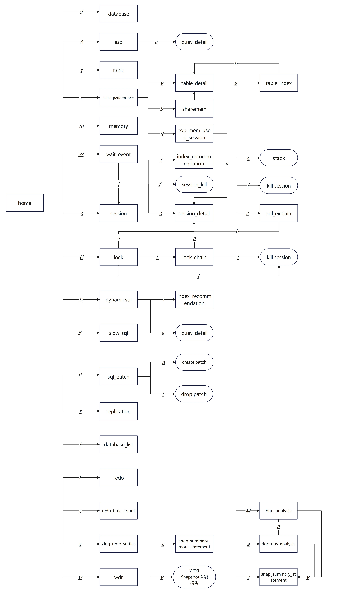

### 2、页面详述

1. `database：`数据库整体资源利用情况的概览，包括当前数据库的统计信息、内存状态、检查点以及double_write的I/O次数、各个时间消耗的信息、SQL的负载情况以及当前服务器的运行状态信息。具体为：

   - pg_stat_database：当前数据库的统计信息，包括事务数、增删改查的行数、临时文件、死锁的情况

   - FILE_REDO_IOSTAT：redo日志写时间
   - BGWRITER_STAT：检查点的次数
   - GLOBAL_DOUBLE_WRITE_STATUS：double_write的I/O次数
   - WORKLOAD_SQL_COUNT：SQL的负载情况。select_count、update_count等
   - SESSION_STAT_ACTIVITY：统计各个状态的session数
   - INSTANCE_TIME：各个时间消耗的信息，包括 CPU、IO等的时间花销 
   - GS_TOTAL_MEMORY_DETAIL：内存情况概览，包括进程所使用的内存、已使用的动态内存、已使用的共享内存、最大动态内存
   - OS_RUNTIME：显示当前服务器的运行状态信息，包括idle和busy的时间统计，用户态和系统的时间统计
   - 流复制状态

2. `session`：

   - 支持查看当前实例中所有session的详细信息，包括session的状态，会话线程的运行时间信息，以及各执行阶段锁消耗的时间等
   - 支持查询单个会话的详细信息，可跳转到session_detail页面。除了显示session界面的信息外，还增加展示该会话的内存，连接SESSION_STAT系统表查询该线程的会话状态信息，例如commit数、回滚数、表扫描总数、实时块fetch数量等
     - 还可根据该单条query语句生成推荐的索引，以及查询该条SQL的执行计划
   - 集成dbmind工具，实现SQL的索引推荐

3. `asp`：从gs_asp系统表中获取某个时间点数据库活动的会话的历史信息，包括会话ID、持续时间、等待事件等。ASP能够帮助用户分析数据库某个时间段中是否存在性能问题。

   > 注意：该页面只能在postgres库下访问，在业务库下查询无数据。asp的采集功能是通过enable_asp参数来控制，需设置enable_asp=on。

4. `Table`： 从PG_STAT_USER_TABLES系统视图中查看单个表的状态信息，支持根据数据库内置的relation_size统计表及表上索引的大小

   - 跳转到table_detail页面可查看指定表的定义，还可查看该表的所有索引的相关信息

5. `Table_performance`：该页面的指标大部分来自`pg_stat_user_tables`系统视图，显示表的状态信息

   - 同样支持从该页面跳转到table_detail页面

6. `Memory`：统计当前实例使用内存的信息（前提：enable_memory_limit=on），包括进程使用的内存、最大动态内存、已使用的shared memory等

   - 如需进一步获取共享内存上下文的详细信息，可跳转至sharemem页面，该页面采集gs_shared_memory_detail的指标
   - 与pg_stat_activiry连接，查看session级别的内存使用情况（前提：enable_memory_limit=on）

7. `dynamicsql`：性能监控视图，提供有关SQL语句执行的性能信息，包括执行计划、执行时间、buffer的访问和命中次数等，可以帮助分析和优化数据库性能，同时增加了调用dbmind的接口，支持对指定SQL的索引推荐功能

8. `lock`：查看数据库锁信息的页面，提供当前节点数据库的所有锁的性能信息，包括等待锁的事务，锁的类型，以及被锁定的对象等。值得一提的是，也进一步提供锁阻塞的详细信息，方便监控慢SQL以及查看锁阻塞的情况

9. `wait_event`：提供查看当前节点数据库中所有等待事件的性能信息，包括等待事件的类型、等待的次数以及等待的时间。极大的帮助用户诊断数据库的性能问题，通过实时监控等待事件，用户可以发现系统中是否存在资源争用、瓶颈或其他性能障碍等，有助于优化数据库配置、调整查询性能，提高数据库系统的响应能力，从而确保数据库系统的稳定性和高校性

10. `replication`：

    - 支持查看当前节点流复制(replication)状态信息，追踪每个备节点的同步状态，检查是否有延迟，以及确定主备节点之间的连接是否正常，已经通过一些函数，直观的查看wal的receive以及replay的延迟
    - 增加对于replication_slot的监控，查看复制槽的状态信息，包括复制槽的状态，xlog接收的延迟等。同时支持在页面上直接删除特定的复制槽

11. `database_list`：提供不另外登录数据库可以查看当前节点database列表

12. `sql_patch`：支持对sql patch的一些操作。包括查看及删除patch，同样也支持通过create_abort_sql_patch()函数创建用于单点规避的SQL PATCH，通过对特定语句进行提前报错规避问题

13. `slow_sql`：支持通过输入某个时间段，查看该段时间内开始的数据库中记录的慢SQL的详细信息，包括SQL的各个时间、执行情况以及锁的相关信息。对于detail字段，借助解析函数也已经做了处理，展示用户易读的信息

14. `redo`：显示本实例的备机的当前回放状态， 展示回放状态主要包括当前回放位置、回放最小恢复点位置等信息

15. `redo_time_count`：显示本节点各个回放线程的各个流程的耗时统计（仅在备机上有有效数据）

16. `xlog_redo_statics`：显示本节点已经回放的各个类型类型的日志统计信息（仅在备机上有有效数据）

17. `wdr`：使用数据库自带WDR工具，展示各个快照节点，并根据各个快照节点实现了针对已执行的sql的毛刺分析和精确分析，有利于用户排查数据库中数据库压力大、sql执行慢等问题


**通用功能快捷键**

| 键位  | 功能     | 范围              | 说明                                                         |
| ----- | -------- | ----------------- | ------------------------------------------------------------ |
| Esc   | 重置按钮 | ogtop全页面支持   | 使用页面小功能时或使用后，回到原始界面时使用                 |
| F     | 冻结屏幕 | ogtop全页面支持   | 在需要查看固定一组数据是使用。Esc按钮进行重置                |
| space | 立即刷新 | ogtop全页面支持   | 立即刷新该页面数据                                           |
| Left  | 左翻页   | ogtop部分页面支持 | 页面需要展示数据太多，根据序号进行分页，使用左右键查看其余部分 |
| Right | 右翻页   | ogtop部分页面支持 | 页面需要展示数据太多，根据序号进行分页，使用左右键查看其余部分 |
| Up    | 上翻     | ogtop部分页面支持 | 多行数据页面展示不完整，利用上下键翻看                       |
| Down  | 下翻     | ogtop部分页面支持 | 多行数据页面展示不完整，利用上下键翻看                       |
| h     | help     | ogtop全页面支持   | 显示帮助                                                     |
| q     | 退出     | ogtop全页面支持   | 退出ogtop工具                                                |
| p     | 快照     | ogtop全页面支持   | 保存此刻展示的页面数据(F9保存，F10丢弃。保存的数据文件在运行文件同一目录下，文件名：ogtop_页面名.txt) |
| /     | 过滤     | ogtop部分页面支持 | 根据选择的条件过滤无关信息条目                               |
| z     | 扩展排序 | ogtop部分页面支持 | 选定需要排序的字段，按照倒序排序，连续选中两次即为正序。第n次：n为奇数-倒序；n为偶数-正序 |

## 三、使用

1. **下载安装包**

   - arm系统：使用ogtop-arm版本包
   - x86系统：使用ogtop-x86版本包

2. **解压**

   ```
   tar -xf ogtop_arm.tar.gz
   tar -xf ogtop_x86.tar.gz
   ```

3. **创建ogtop专用数据库用户**

   示例中创建了测试用的数据库，实际使用中可以不创建，但是需要对数据库用户授权。
   实际使用中也可以直接使用omm用户或其他已有用户（需确保权限足够）。

   ```
   create database ogtop ;
   \c ogtop 
   create user ogtop sysadmin monadmin password 'ogtop@123';
   alter database ogtop owner to ogtop ;
   grant USAGE on SCHEMA dbe_perf to ogtop ;
   ```

   > 注意：连接数据库的用户必须有dbe_perf schema的USUAGE权限。

4. **运行ogtop**

   运行ogtop后，进入首页

   ```
   ./ogtop -h ip -p port -d database -u user 
   例：
   ./ogtop -h 197.0.194.195 -p 26000 -d ogtop -u ogtop
   ```


### 1、home - 首页

home页面是整个ogtop监控工具的默认主页与导航入口。

用户使用ogtop数据库监控工具连接数据库，进入首页home页面，可以根据页面提示进入对应的功能模块查看对应的数据。

用户在任意页面都可以通过页面快捷键来切换到不同的页面。

每个页面都有不同的辅助功能快捷键，可以在不同页面通过按h进入help页面查看。

> Tips：单页展示不下的行或者列，可以通过上下左右键进行翻页

#### 1）页面

```
  Local Time: 2024-06-06 09:54:45                                             home                                                                        Port: 26000
  Query interval: 2s                                                                                                                                      dbname: mladb
┌─────────────────────────────────────────────────────────────────────────────────────────────────────────────────────────────────────────────────────────────────────────────────────────────────────────────┐
│                                                                                ___   ____ _                                                                                                                 │
│                                                                               / _ \ / ___| |_ ___  _ __                                                                                                     │
│                                                                              | | | | |  _| __/ _ \| '_ \                                                                                                    │
│                                                                              | |_| | |_| | || (_) | |_) |                                                                                                   │
│                                                                               \___/ \____|\__\___/| .__/                                                                                                    │
│                                                                                                   |_|                                                                                                       │
│                                                                                                                                                                                                             │
│                                                                             d: database               s: session                                                                                            │
│                                                                             A: asp                    t: Table                                                                                              │
│                                                                             T: Table_performance      m: Memory                                                                                             │
│                                                                             D: dynamicsql             U: lock                                                                                               │
│                                                                             W: wait_event             r: replication                                                                                        │
│                                                                             l: database_list          P: sql_patch                                                                                          │
│                                                                             B: slow_sql               E: redo                                                                                               │
│                                                                             o: redo_time_count        x:xlog_redo_statics                                                                                   │
│                                                                             w: wdr                                                                                          │
│                                                                                                                                                                                                             │
│                                                                                                                                                                                                             │
│                                                                                                                                                                                                             │
│                                                                                                                                                                                                             │
│                                                                                                                                                                                                             │
│                                                                                                                                                                                                             │
│                                                                           Warning:the time of ogtop local server is different                                                                               │
│                                                                           from the time select from target database！！                                                                                     │
│                                                                                                                                                                                                             │
│                                                                                                                                                                                                             │
│                                                                                                                                                                                                             │
│                                                                                                                                                                                                             │
│                                                                                                                                                                                                             │
│                                                                                                                                                                                                             │
│                                                                                                                                                                                                             │
│                                                                                                                                                                                                             │
│                                                                                                                                                                                                             │
│                                                                                                                                                                                                             │
└─────────────────────────────────────────────────────────────────────────────────────────────────────────────────────────────────────────────────────────────────────────────────────────────────────────────┘

```

**页面指标**：

| 指标           | 描述                                                         |
| -------------- | ------------------------------------------------------------ |
| Local Time     | 当前服务器时间                                               |
| Query interval | 查询间隔（每2s刷新一次数据）。如页面冻结，该指标的值为86400s |
| Port           | 数据库端口                                                   |
| dbname         | 连接的数据库名                                               |

#### 2）功能快捷键

| 键位 | 功能              | 范围                              | 说明                                   |
| ---- | ----------------- | --------------------------------- | -------------------------------------- |
| d    | database          | ogtop全页面支持                   | database数据概览页面                   |
| s    | session           | ogtop全页面支持                   | session会话连接数据概览页面            |
| A    | asp               | ogtop全页面支持                   | gs_asp系统表数据概览页面               |
| t    | table             | ogtop全页面支持                   | 表基础数据概览页面                     |
| T    | table_performance | ogtop全页面支持                   | 表性能数据概览页面                     |
| m    | memory            | ogtop全页面支持                   | memory内存数据概览页面                 |
| D    | dynamicsql        | ogtop全页面支持                   | dynamicsql数据概览页面                 |
| U    | lock              | ogtop全页面支持                   | lock锁数据概览页面                     |
| W    | wait_event        | ogtop全页面支持                   | wait_event数据概览页面                 |
| r    | replication       | ogtop全页面支持                   | 流复制数据概览页面                     |
| l    | database_list     | ogtop全页面支持                   | database列表概览页面                   |
| B    | slow_sql          | ogtop全页面支持                   | 慢SQL概览页面                          |
| P    | sql_patch         | ogtop全页面支持                   | SQL PATCH概览页面                      |
| E    | redo              | ogtop全页面支持                   | 备机回放状态数据概览页面               |
| o    | redo_time_count   | ogtop全页面支持                   | 回放线程耗时统计概览页面（仅备机）     |
| x    | xlog_redo_statics | ogtop全页面支持                   | 已回放的日志统计信息概览页面（仅备机） |
| w    | wdr               | ogtop全页面支持                   | WDR数据概览页面                        |
| h    | help              | ogtop全页面支持（HOME页面不支持） | help帮助概览页面                       |

### 2、help - 帮助页

进入ogtop任意界面（HOME页面不支持），按`h`键，可进入帮助页面，在这里可以查看不同页面可进行操作的所有按键及其功能。

三部分：

- **pages**：全局快捷键。全页面支持跳转
- **function**：功能快捷键。部分页面支持
- **page map**：显示子页面详情

```
┌─────────────────────────────────────────────────────────────────────────────────────────────────────────────────────────────────────────────────────────────────────────────────────────────────────────────┐
│                                                                             pages                                                                                                                           │
│                                                                                                                                                                                                             │
│                                                                                                                                                                                                             │
│                                                                                                                                                                                                             │
│                                                    d: database                                        s: session                                                                                            │
│                                                    A: asp                                             t: Table                                                                                              │
│                                                    T: Table_performance                               m: Memory                                                                                             │
│                                                    D: dynamicsql                                      U: lock                                                                                               │
│                                                    W: wait_event                                      r: replication                                                                                        │
│                                                    l: database_list                                   P: sql_patch                                                                                          │
│                                                    B: slow_sql                                        E: redo                                                                                               │
│                                                    o: redo_time_count                                 x:xlog_redo_statics                                                                                   │
│                                                    w: wdr                                                                                                                                                   │
│_____________________________________________________________________________________________________________________________________________________________________________________________________________│
│                                                                             function                                                                                                                        │
│                                                                                                                                                                                                             │
│                                                                                                                                                                                                             │
│                                                                                                                                                                                                             │
│                                                    v: table_detail                                    /: conditional filtration                                                                             │
│                                                    z: sort by column                                  left: page left                                                                                       │
│                                                    right: page right                                  h: help                                                                                               │
│                                                    q: close                                           p: snapshoot(f9 save f10 discard)                                                                     │
│                                                    space: immediate refresh                           F: freeze screen                                                                                      │
│                                                    esc: reset                                                                                                                                               │
│_____________________________________________________________________________________________________________________________________________________________________________________________________________│
│                                                                             page map                                                                                                                        │
│                                                                                                                                                                                                             │
│                                                                                                                                                                                                             │
│                                                                                                                                                                                                             │
│                                                    session-->session_detail-->session_detail_plan                                                                                                           │
│                                                    session-->index_recommendation                                                                                                                           │
│                                                    table-->table_detail-->table_index                                                                                                                       │
│                                                    table_performance-->table_detail-->table_index                                                                                                           │
│                                                    lock-->session_detail           
│                                                        -->lock_chain-->session_detail                                                                                                                      │
│                                                    memory-->sharemem&top_mem_used_session                                                                                                                   │
│                                                          -->top_mem_used_session-->session_detail                                                                                                           │
│                                                    dynamicsql-->index_recommendation                                                                                                                        │
│                                                    wdr-->snap_summary_more_statement-->snap_summary_statement&burr_analysis&rigorous_analysis                                                                 │
│                                                       -->burr_analysis-->snap_summary_statement&rigorous_analysis                                                                                           │
│                                                       -->rigorous_analysis-->snap_summary_statement                                                                                                         │
└─────────────────────────────────────────────────────────────────────────────────────────────────────────────────────────────────────────────────────────────────────────────────────────────────────────────┘
```

### 3、database - 全局总览页

该模块显示数据库的各项状态指标总览。进入ogtop的任意界面后按`d`即可进入database指标查看页面。

database页面提供数据库的总体概览信息，包括当前的活跃会话比例，当前节点的状态以及角色，内存参数的值等

```
┌─────────────────────────────────────────────────────────────────────────────────────────────────────────────────────────────────────────────────────────────────────────────────────────────────────────────┐
│                                                                                                                                                                                                             │
│                                                            active session/session: >>4.13%                                                                                                                  │
│                                                          blks_hit/(blks_hit+read): >>>>>>>>>>>>>>>>>>37.59%                                                                                                 │
│                                                            select_count/dml_count: >>>>>>>>>19.42%                                                                                                          │
│                                                              DATA_IO_TIME/DB_TIME: >>>>>>>>>>>23.87%                                                                                                        │
│                                            dynamic_used_memory/max_dynamic_memory: >>>>>>>>>>>>>>>>>34.84%                                                                                                  │
│                                                                busy_time/all_time: >>>>>>>>>>>>>>>>>>>>>>>>>>>>>>61.7%                                                                                      │
│_____________________________________________________________________________________________________________________________________________________________________________________________________________│
│                                                                                                                                                                                                             │
│                                                                                                                                                                                                             │
│                           start_date            start_time            wal_status           LocalRole             ProcesMem            Dynamic_Mem           Shared_Mem                                      │
│                           2024-01-02            14:13:41              Normal               Primary               19154                4866                  12512                                           │
│                                                                                                                                                                                                             │
│                                                                                                                                                                                                             │
│                           Session               Actsess               Waiting              idleintran            xact_commit          xact_rollback         totalcount                                      │
│                           557                   23                    0                    0                     7404                 8                     7112                                            │
│                                                                                                                                                                                                             │
│                                                                                                                                                                                                             │
│                           ddl_count             dml_count             dcl_count            select_count          update_count         insert_count          delete_count                                    │
│                           0                     7112                  0                    1381                  0                    5730                  1                                               │
│                                                                                                                                                                                                             │
│                                                                                                                                                                                                             │
│                           num_cpus              num_cpu_cores         num_cpu_sockets      blks_read             blks_hit             hitratio              tup_fetched                                     │
│                           24                    12                    2                    1305108               786146               37.59                 118794                                          │
│                                                                                                                                                                                                             │
│                                                                                                                                                                                                             │
│                           tup_inserted          tup_update            tup_delete           DB_TIME(s)            cpu_time(s)          execute_time(s)       data_io_time(s)                                 │
│                           5594                  1                     0                    32.6762               18.146               17.2791               7.7988                                          │
│                                                                                                                                                                                                             │
│                                                                                                                                                                                                             │
│                           blk_read_time         blk_write_time        redo_writetim        temp_files            temp_bytes           conflicts             deadlocks                                       │
│                           0                     0                     97.462               484                   49195039932          0                     0                                               │
│                                                                                                                                                                                                             │
│                                                                                                                                                                                                             │
│                           checkpoints           pgwrits               double_writes        physical_memory_bytes idle_time            user_time             sys_time                                        │
│                           0                     0                     8                    49771872256           38.3%                49.06%                12.64%                                          │
│                                                                                                                                                                                                             │
│                                                                                                                                                                                                             │
│                           iowait_time           nice_time             vm_page_in_bytes     vm_page_out_bytes     os_load_processes                                                                          │
│                           5.2%                  0.0%                  0                    0                     19.73                                                                                      │
│                                                                                                                                                                                                             │
│                                                                                                                                                                                                             │
│                                                                                                                                                                                                             │
└─────────────────────────────────────────────────────────────────────────────────────────────────────────────────────────────────────────────────────────────────────────────────────────────────────────────┘
```

**页面指标**：

| 指标                                   | 描述                                     |
| -------------------------------------- | ---------------------------------------- |
| active session/session                 | 活动会话数占总会话数的比例               |
| blks_hit/(blks_hit+read)               | 查询命中率                               |
| select_count/dml_count                 | select在所有dml中的占比                  |
| DATA_IO_TIME/DB_TIME                   | 数据io时间在数据库时间的占比             |
| dynamic_used_memory/max_dynamic_memory | 动态内存使用率                           |
| busy_time/all_time                     | 磁盘io的繁忙程度                         |
| start_date                             | 数据库启动日期                           |
| start_time                             | 数据库启动时间                           |
| wal_status                             | 主从(集群)状态                           |
| LocalRole                              | 本地角色                                 |
| ProcesMem                              | 已使用的进程内存                         |
| Dynamic_Mem                            | 已使用的动态内存                         |
| Shared_Mem                             | 已使用的共享内存                         |
| Session                                | 会话数                                   |
| Actsess                                | 正在运行的会话数                         |
| Waiting                                | 等待锁的会话数                           |
| idleintran                             | idle in transaction 状态的session会话数  |
| xact_commit                            | 事务提交数                               |
| xact_rollback                          | 事务回滚数                               |
| totalcount                             | totalcount=ddl_count+dml_count+dcl_count |
| ddl_count                              | ddl数量                                  |
| dml_count                              | dml数量                                  |
| dcl_count                              | dcl数量                                  |
| select_count                           | select数量                               |
| update_count                           | update数量                               |
| insert_count                           | insert数量                               |
| delete_count                           | delete数量                               |
| num_cpus                               | CPU 数量                                 |
| num_cpu_cores                          | CPU 核数                                 |
| num_cpu_sockets                        | CPU sockets数                            |
| blks_read                              | 读取块数                                 |
| blks_hit                               | 命中块数                                 |
| hitratio                               | 命中率                                   |
| tup_fetched                            | fetch行数                                |
| tup_inserted                           | insert行数                               |
| tup_update                             | update行数                               |
| tup_delete                             | delete行数                               |
| DB_TIME/ms                             | 数据库时间                               |
| cpu_time                               | cpu时间                                  |
| execute_time                           | sql执行时间                              |
| data_io_time                           | 数据io时间                               |
| blk_read_time                          | 块读取时间                               |
| blk_write_time                         | 块写入时间                               |
| redo_writetim                          | redo日志写时间                           |
| temp_files                             | 临时文件数                               |
| temp_bytes                             | 临时文件大小                             |
| conflicts                              | 数据库冲突数                             |
| deadlocks                              | 死锁数量                                 |
| checkpoints                            | checkpoints数量                          |
| double_writes                          | 双写次数                                 |
| physical_memory_bytes                  | 物理内存大小                             |
| idle_time                              | 处理器空间时间                           |
| user_time                              | 用户态的时间                             |
| sys_time                               | 内核态时间                               |
| iowait_time                            | iowait时间                               |
| nice_time                              | Cpu调度优先级花费的时间                  |
| vm_page_in_bytes                       | 虚拟内存中 从Swap区读入的字节数          |
| vm_page_out_bytes                      | 虚拟内存中 从Swap区读出的字节数          |
| os_load_processes                      | 负载                                     |

### 4、session - 会话

该模块显示session数据库会话连接的各项状态指标。进入ogtop任意界面后按`s`进入查看该模块的功能。

#### 1）session

##### 		a. 流程图

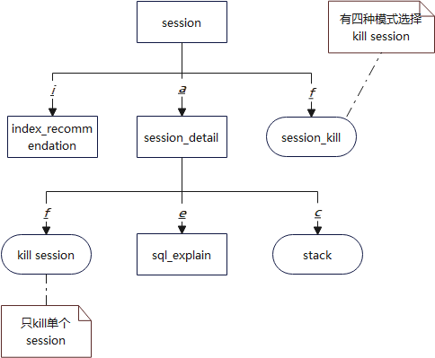

##### 		b. 页面

进入Home页面，按`s`进入session主页面。

该页面提供查询数据库所有session连接的大致情况

```
┌─────────────────────────────────────────────────────────────────────────────────────────────────────────────────────────────────────────────────────────────────────────────────────────────────────────────┐
│                                                                                                                                                                                                             │
│                           —————————————————————————————————————————————————————————————————————————————————————————————————————————————————————————————                                                     │
│                           |active session/session: >2.4%                                                                                               |                                                    │
│                           —————————————————————————————————————————————————————————————————————————————————————————————————————————————————————————————                                                     │
│                           n_commit............: 4182                                                                           n_blocks_fetched.........: 370062                                            │
│                           n_rollback..........: 27                          n_local_blocks_read: 0                             n_physical_read_operation: 370062                                            │
│                           n_sql...............: 4284                        n_sort_in_disk.....: 0                             n_shared_blocks_dirtied..: 3320                                              │
│                           n_table_scan........: 54668                       n_cu_hdd_asyn_read.: 0                             n_local_blocks_dirtied...: 0                                                 │
│                           n_shared_blocks_read: 69432                       n_blocks_read_time.: 5328148                       n_blocks_write_time......: 0                                                 │
│                           n_sort_in_memory....: 3                           n_cu_mem_hit.......: 0                             n_cu_hdd_sync_read.......: 0                                                 │
│                                                                                                                                                                                                             │
│_____________________________________________________________________________________________________________________________________________________________________________________________________________│
│pid                       query                     current_state             xact_start_time(ms)       query_start_time(ms)      waiting                  wait_status               wait_event              │
│_____________________________________________________________________________________________________________________________________________________________________________________________________________│
│140606852232960           WLM fetch collect info    active                    932840783.516             932840783.521             False                    none                      none                    │
│                          from data nodes                                                                                                                                                                    │
│140605582866176           insert into mlausr.OS_OS_ active                    512.149                   512.154                   False                    wait cmd                  wait cmd                │
│                          PERFORMANCE(host,target_i                                                                                                                                                          │
│                          p,snaptime                                                                                                                                                                         │
│140612202985216           merge into MLAUSR.JMX_KAF active                    558.401                   558.406                   False                    none                      none                    │
│                          KA_CONSUME_PERFORMANCE_SU                                                                                                                                                          │
│                          MMARY as P                                                                                                                                                                         │
│140601674102528           autovacuum: VACUUM mlausr active                    282286.069                282286.074                False                    vacuum gpi: mlausr.og_wai vacuum gpi              │
│                          .og_wait_events_data                                                                                                             t_events_data, autovacuum                         │
│                          (freeze old tu                                                                                                                                                                     │
│140586281662208           delete from               active                    542.555                   542.078                   False                    none                      none                    │
│                          OS_TOMCAT_PERFORMANCE_PRE                                                                                                                                                          │
│                          where TARGET_IP='197.2                                                                                                                                                             │
│140578625533696           insert into mlausr.OS_OS_ active                    514.229                   514.234                   False                    none                      none                    │
│                          PERFORMANCE(host,target_i                                                                                                                                                          │
│                          p,snaptime                                                                                                                                                                         │
└─────────────────────────────────────────────────────────────────────────────────────────────────────────────────────────────────────────────────────────────────────────────────────────────────────────────┘
```

**页面指标**：

| 指标                      | 描述                                                         |
| ------------------------- | ------------------------------------------------------------ |
| active session/session    | 活动会话占总会话数的比例                                     |
| n_commit                  | 数据库实时提交总数                                           |
| n_rollback                | 数据库实时回滚总数                                           |
| n_sql                     | 数据库实时sql总数                                            |
| n_table_scan              | 数据库实时表扫描总数                                         |
| n_shared_blocks_read      | 数据库实时共享块读取总数                                     |
| n_sort_in_memory          | 数据库实时内存排序总数                                       |
| n_local_blocks_read       | 数据库实时本地块读取总数                                     |
| n_sort_in_disk            | 数据库实时磁盘排序总数                                       |
| n_cu_hdd_asyn_read        | 数据库实时磁盘异步读取cu总数                                 |
| n_blocks_read_time        | 数据库实时块读取总时间                                       |
| n_cu_mem_hit              | 数据库实时CU内存命中总次数                                   |
| n_blocks_fetched          | 数据库实时块fetch总数                                        |
| n_physical_read_operation | 数据库实时物理读操作总数                                     |
| n_shared_blocks_dirtied   | 数据库实时脏共享块总数                                       |
| n_local_blocks_dirtied    | 数据库实时脏本地块总数                                       |
| n_blocks_write_time       | 数据库实时块写入总时间                                       |
| n_cu_hdd_sync_read        | 数据库实时磁盘同步读取cu总数                                 |
| pid                       | 后台线程ID                                                   |
| query                     | 查询的sql语句                                                |
| current_state             | 该后台当前总体状态                                           |
| xact_start_time/ms        | 启动当前事务的时间                                           |
| query_start_time/ms       | 查询当前query的时间                                          |
| waiting                   | 如果后台当前正等待锁则为true                                 |
| wait_status               | 当前线程的等待状态                                           |
| wait_event                | 如果wait_status是acquire lock、acquire lwlock、wait io三种类型，此列描述具体的锁、轻量级锁、IO的信息。否则是空。 |
| db_time/s                 | 有效执行时间                                                 |
| cpu_time/s                | cpu时间花销                                                  |
| excute_time/s             | 执行器内时间花销                                             |
| data_io_time              | IO时间花销                                                   |
| db_name                   | 数据库名                                                     |
| user_name                 | 会话发起的用户名                                             |
| application_name          | 应用程序名                                                   |
| client_addr               | 客户端地址                                                   |

##### c. 快捷键

| 键位 | 功能                     | 范围            | 说明                                                         |
| ---- | ------------------------ | --------------- | ------------------------------------------------------------ |
| a    | 前往session_detail页面   | session页面支持 | 复制需要查询的session的pid，输入到提示框内                   |
| i    | dbmind的索引推荐功能     | session页面支持 |                                                              |
| f    | 根据单选按钮kill session | session页面支持 | Kill session时为四种模式，force_all、force_by_dbname、force_idle、force_by_pid，按需谨慎选择 |

#### 2）session_detail

```
session >> session_detail
```

##### 	a. 页面

进入session 主页面，按`a`键，弹出如下输入框，输入要查询session的pid，以`enter`结尾，进入详细信息页面：

```
┌─────────────────────────────────────────────────────────────────────────┐
│                                                                         │
│please input pid(end with enter):140614493533952                         │
│                                                                         │
└─────────────────────────────────────────────────────────────────────────┘
```

成功进入 pid=140614493533952 的session详情页面,此页面针对特定session展示更为详细的指标信息：

```
┌───────────────────────────────────────────────────────────────────────────────────────────────────────────────────────────────────────────────────────────────────────────────────────────────────────────────────┐
│query_id:0                 block_sessionid:-         backend_start:2024-01-19   query_start:1705643931781 datid:2050516356           datname:ogtop             usesysid:2050516363        usename:ogtop            │
│                                                     09:11:32                                                                                                                                                      │
│                                                                                                                                                                                                                   │
│application_name:gsql      client_addr:-             client_hostname:-          client_port:-1            xact_start_time:2024-01-19 state_change_time:2024-01 waiting:False              total_cpu_time(s):0.0    │
│                                                                                                          13:58:43                   -19 13:58:51                                                                  │
│                                                                                                                                                                                                                   │
│db_time(ms):0.0            cpu_time(ms):0.0          execution_time(ms):0.0     data_io_time(ms):0.0      parse_time(ms):0.0         plan_time(ms):0           rewrite_time(ms):0.0       net_send_time(ms):0.0    │
│                                                                                                                                                                                                                   │
│pl_execution_time(ms):0.0  pl_compilation_time(ms):0 init_mem:5                 used_mem:0                peak_mem:1                 wait_status:wait cmd      locktag:-                  lockmode:-               │
│                           .0                                                                                                                                                                                      │
│                                                                                                                                                                                                                   │
│n_commit:0                 n_rollback:0              n_sql:0                    n_table_scan:0            n_blocks_fetched:0         n_physical_read_operation n_shared_blocks_dirtied:0  n_local_blocks_dirtied:0 │
│                                                                                                                                     :0                                                                            │
│                                                                                                                                                                                                                   │
│n_shared_blocks_read:0     n_local_blocks_read:0     n_blocks_read_time:0       n_blocks_write_time:0     n_sort_in_memory:0         n_sort_in_disk:0          n_cu_mem_hit:0             n_cu_hdd_sync_read:0     │
│                                                                                                                                                                                                                   │
│n_cu_hdd_asyn_read: 0                                                                                                                                                                                              │
│___________________________________________________________________________________________________________________________________________________________________________________________________________________│
│query: select * from index_test where b = 'test_999' ;                                                                                                                                                             │
│                                                                                                                                                                                                                   │
```

**页面指标**：

| 指标                      | 描述                                                         |
| ------------------------- | ------------------------------------------------------------ |
| query_id                  | 查询语句 的id                                                |
| block_sessionid           | 阻塞当前线程获取锁的会话标识。                               |
| backend_start             | 开始当前活跃查询的时间（如果state的值不是active，则这个值是上一个查询的开始时间） |
| query_start               | 该过程开始的时间，即当客户端连接服务器时间                   |
| datid                     | 数据库ID                                                     |
| datname                   | 数据库名                                                     |
| usesysid                  | 登陆该后台的用户OID                                          |
| usename                   | 登陆该后台的用户名                                           |
| application_name          | 应用程序名                                                   |
| client_addr               | 客户端地址                                                   |
| client_hostname           | 客户端主机名                                                 |
| client_port               | 客户端端口                                                   |
| xact_start_time           | 启动当前事务的时间                                           |
| state_change_time         | 上次状态改变的时间                                           |
| waiting                   | 如果后台当前正等待锁则为true                                 |
| total_cpu_time/s          | 语句在数据库节点上的CPU总时间                                |
| db_time/ms                | 有效执行时间                                                 |
| cpu_time/ms               | cpu时间花销                                                  |
| excute_time/ms            | 执行器内时间花销                                             |
| data_io_time/ms           | IO时间花销                                                   |
| parse_time/ms             | Sql解析时间花销                                              |
| plan_time/ms              | 生成plan的时间花销                                           |
| rewrite_time/ms           | sql重写的时间花销                                            |
| net_send_time/ms          | 网络上的时间花销                                             |
| pl_execution_time/ms      | plpgsql（存储过程）执行的时间花销                            |
| pl_compilation_time/ms    | plpgsql（存储过程）编译的时间花销                            |
| init_mem                  | 当前正在执行作业进入执行器前已分配的内存                     |
| used_mem                  | 当前正在执行作业已分配的内存                                 |
| peak_mem                  | 当前正在执行作业已分配的内存峰值                             |
| wait_status               | 当前线程的等待状态                                           |
| locktag                   | 当前线程正在等待锁的信息。                                   |
| lockmode                  | 当前线程正等待获取的锁模式。包含表级锁、行级锁、页级锁下的各模式。 |
| n_commit                  | 实时提交数                                                   |
| n_rollback                | 实时回滚数                                                   |
| n_sql                     | 实时sql数                                                    |
| n_table_scan              | 实时表扫描数                                                 |
| n_shared_blocks_read      | 实时共享块读取数                                             |
| n_sort_in_memory          | 实时内存排序数                                               |
| n_local_blocks_read       | 实时本地块读取数                                             |
| n_sort_in_disk            | 实时磁盘排序数                                               |
| n_cu_hdd_asyn_read        | 实时磁盘异步读取cu数                                         |
| n_blocks_read_time        | 实时块读取时间                                               |
| n_cu_mem_hit              | 实时CU内存命中次数                                           |
| n_blocks_fetched          | 实时块fetch数                                                |
| n_physical_read_operation | 实时物理读操作数                                             |
| n_shared_blocks_dirtied   | 实时脏共享块数                                               |
| n_local_blocks_dirtied    | 实时脏本地块数                                               |
| n_blocks_write_time       | 实时块写入时间                                               |
| n_cu_hdd_sync_read        | 实时磁盘同步读取cu数                                         |
| query                     | 查询语句内容                                                 |

##### 	b. 快捷键

| 键位 | 功能                       | 范围                   | 说明                                 |
| ---- | -------------------------- | ---------------------- | ------------------------------------ |
| f    | Kill session               | session_detail页面支持 | 使用功能时需在复检页面在进行二次确认 |
| e    | 前往session_query_plan页面 | session_detail页面支持 | 页面所示内容为session_query_plan     |

**f - kill session**：

在会话详细信息页按`f`，提示是否终止会话，输入y确认杀死该session；否则输入 n

杀死当前session：

```
┌──────────────────────────────────────────────┐
│  whether to killFalse(y/n):                  │
│                                              │
```

session 已经被杀掉：

```
ogtop=> end;
FATAL:  terminating connection due to administrator command
could not send data to server: Broken pipe
The connection to the server was lost. Attempting reset: Failed.
```

#### 3）sql_explain

该页面分为两部分：

- **advise**：索引推荐。指定session的查询语句生成推荐的索引
- **explain**：显示该条语句的执行计划

```
session >> session_detail >> sql_explain
```

界面显示：

```
┌─────────────────────────────────────────────────────────────────────────┐
│                                                                         │
│Please input schema_name(end with enter):public                          │
│                                                                         │
└─────────────────────────────────────────────────────────────────────────┘
```

显示结果：

```
┌─────────────────────────────────────────────────────────────────────────────────────────┐
│                                                                                         │
│query                                                                                    │
│_________________________________________________________________________________________│
│select * from index_test where b = 'test_999' ;                                          │
│                                                                                         │
│                                                                                         │
│advise                                                                                   │
│_________________________________________________________________________________________│
│('public', 'index_test', 'b', '')                                                        │
│                                                                                         │
│                                                                                         │
│explain                                                                                  │
│_________________________________________________________________________________________│
│('Seq Scan on index_test  (cost=0.00..1791.00 rows=1 width=14)',)                        │
│("  Filter: (b = 'test_999'::text)",)                                                    │
│                                                                                         │
```

> 提供可以通过键`b`，返回到session_detail界面

#### 4）session_kill

```
session >> session_kill
```

进入session主页面，按`f`键，弹出session_kill的窗口，有下图所示的四种模式：

- **force_all**：kill非omm用户的所有后台线程
- **force_by_dbname**：kill连接指定数据库的所有session
- **force_idle**：kill 状态为 idle in transaction且持续时间超过10min的session
- **force_by_pid**：指定 pid 进行kill

> 原理：使用pg_terminate_backend()函数完成kill操作

```
┌───────────────────────────────────┐
│< force_all               >        │
│< force_by_dbname         >        │
│< force_idle              >        │
│< force_by_pid            >        │
```

```
┌────────────────────────────────────────┐
│please input pid(end with enter):       │
```

#### 注意事项

1.暂时后台获取数据时较慢，在使用其他小功能时，摁完快捷键后需等待2s左右，等待页面刷新结束

2.在使用kill session功能时，请谨慎选择，避免产生无法预估事件

### 5、asp

登陆ogtop任意界面，按`A`键进入asp模块，查看当前节点的某个时间段的历史会话情况

#### a. 流程图

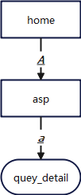


#### b. 页面

输入要查看的时间点，显示前后一分钟的数据：

```
┌──────────────────────────────────────────────────────────────────────┐
│please enter what to find(year-month-day hour:minute:second):

页面显示：
┌───────────────────────────────────────────────────────────────────────────────────────────────────────────────────────────────────────────────────────────────────────────────────────────────────────────────────┐
│datname                    username                  sessionid                  client_addr               duration_ms                event                     unique_query               sample_time              │
│___________________________________________________________________________________________________________________________________________________________________________________________________________________│
│mladb                      mlausr                    140592184293120            197.0.35.106              1.698                      WALFlushWait              insert into MLAUSR.JMX_KAF 2024-01-22               │
│                                                                                                                                                               KA_PERFORMANCE             09:59:00.435903+08       │
│                                                                                                                                                               (HOST,SNAPTIME,CLAS                                 │
│mladb                      mlausr                    140592594478848            197.0.35.115              1.68                       none                      insert into MLAUSR.JMX_KAF 2024-01-22               │
│                                                                                                                                                               KA_PERFORMANCE             09:59:00.435946+08       │
```

#### c.快捷键

| 键位 | 功能          | 范围        | 说明                     |
| ---- | ------------- | ----------- | ------------------------ |
| a    | 查看query详情 | asp页面支持 | 用于查看query中的sql详情 |

### 6、Table - 表

登陆ogtop任意界面，按`t`键进入table模块，查看数据库中表数据的概览情况

#### 1）Table 主页面

##### 	a. 流程图

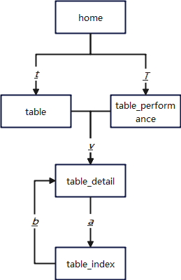

##### 		b. 页面

显示表的基础信息：

```
┌────────────────────────────────────────────────────────────────────────────────────────────────────────────────────────────────────────────────────────────────────────────────────────────────────────────────────────────────────────────────────────────────────────────────────────────────────────────────────┐
│datname                   schemaname                relname                   relid                     tabsize/MB                idxsize/MB               totalsize/MB              last_vacuum               last_autovacuum           last_analyze             last_autoanalyze           last_data_changed       │
│____________________________________________________________________________________________________________________________________________________________________________________________________________________________________________________________________________________________________________________│
│ogtop                     public                    index_test                2050719944                4.225                     0.0                      4.225                     -                         -                         2024-01-18               2024-01-18                2024-01-18              │
│ogtop                     dbe_pldeveloper           gs_source                 12547                     0.008                     0.023                    0.031                                                                         14:35:19.613651+08:00    14:35:19.613651+08:00     14:33:57.945874+08:00   │
│                                                                                                                                                                                     2024-01-18                2024-01-18                -                        -                         -                       │
│ogtop                     db4ai                     snapshot                  14933                     0.008                     0.016                    0.023                     11:40:18.523533+08:00     11:40:18.523533+08:00                                                                                │
│                                                                                                                                                                                     2024-01-18                2024-01-18                -                        -                         -                       │
│ogtop                     dbe_pldeveloper           gs_errors                 12554                     0.008                     0.008                    0.016                     2024-01-18                2024-01-18                -                        -                         -                       │
│                                                                                                                                                                                     11:40:18.559381+08:00     11:40:18.559381+08:00                                                                                │
```

**页面指标**:

| 指标              | 描述                                                         |
| ----------------- | ------------------------------------------------------------ |
| datname           | 数据库名                                                     |
| schemaname        | schema名                                                     |
| relname           | 表名                                                         |
| relid             | 表的oid                                                      |
| tabsize/MB        | 表大小 pg_table_size()                                       |
| idxsize/MB        | 索引大小 pg_indexes_size()                                   |
| totalsize/MB      | pg_total_relation_size                                       |
| last_vacuum       | 最后一次清理该表的时间。                                     |
| last_autovacuum   | 上次被autovacuum守护进程清理该表的时间。                     |
| last_analyze      | 上次分析该表的时间                                           |
| last_autoanalyze  | 上次被autovacuum守护进程分析该表的时间。                     |
| last_data_changed | 记录这个表上一次数据发生变化的时间（引起数据变化的操作包括INSERT/UPDATE/DELETE、EXCHANGE/TRUNCATE/DROP partition），该列数据仅在本地数据库主节点记录。 |

##### 		c. 快捷键

| 键位 | 功能              | 范围          | 说明                                                      |
| ---- | ----------------- | ------------- | --------------------------------------------------------- |
| v    | 前往table详情页面 | table页面支持 | 复制需要查询的table的schemaname.tablename，输入到提示框内 |

#### 2）table_detail

该页面显示表的详细信息：

```
table >> table_detail
```

进入table主页面，按键 `v`进入table_detail页面：

```
┌──────────────────────────────────────────────────────────────────────┐
│please input schemaname.relname(end with enter):public.index_test      │
└──────────────────────────────────────────────────────────────────────┘

┌───────────────────────────────────────────────────────────────────────────────────────────────────────────────────────────────────────────────────────────────────────────────────┐
│datname:ogtop                                        relid:2064021426                                     schemaname:public                                    relname:index_test   │
│___________________________________________________________________________________________________________________________________________________________________________________│
│table_detail:  
│SET search_path = public;                                                         
│CREATE TABLE index_test (     
│    a integer,            
│    b text                     
│)                                  
│WITH (orientation=row, compression=no);  
│CREATE INDEX index_test_b_idx ON index_test USING btree (b) TABLESPACE pg_default;  
```

**快捷键**：

| 键位 | 功能                    | 范围                 | 说明                                     |
| ---- | ----------------------- | -------------------- | ---------------------------------------- |
| a    | 前往table_index详情页面 | table_detail页面支持 | 复制需要查询的table的oid，输入到提示框内 |

#### 3）table_index

该页面显示指定表上所有的索引信息

```
table >> table_detail >> table_index
```

进入table主页面，按`a`键，输入指定的表名，进入到table_index页面：

```
┌──────────────────────────────────────────────────────────────────────┐
│please input relid(end with enter):                                    │
└──────────────────────────────────────────────────────────────────────┘

┌───────────────────────────────────────────────────────────────────────────────────────────────────────────────────────────────────────────────────────────────────────────────────────────────────────────────────┐
│                                                                                                                                                                                                                   │
│                                                                                                                                                                                                                   │
│___________________________________________________________________________________________________________________________________________________________________________________________________________________│
│indexrelname               relname                   schemaname                 datname                   idx_scan                   idx_tup_read              idx_tup_fetch              idx_blks_hit             │
│___________________________________________________________________________________________________________________________________________________________________________________________________________________│
│index_test_b_idx           index_test                public                     ogtop                     0.0                        0.0                       0.0                        0.0                      │
│                                                                                                                                                                                                                   │
│                                                                                                                                                                                                                   │
│___________________________________________________________________________________________________________________________________________________________________________________________________________________│
│indexrelname               relname                   phyrds                     phywrts                   phyblkrd                   phyblkwrt                 readtim                    writetim                 │
│___________________________________________________________________________________________________________________________________________________________________________________________________________________│
│index_test_b_idx           index_test                0.0                        0.0                       0.0                        0.0                       0.0                        0.0                      │
│                                                                                                                                                                                                                   │
```

注意：如果表上没有索引，则输出：

```
┌───────────────────────────────────────────────────────────────────────────────────────┐
│table_index page temporarily inaccessible：the index queried is an invalid index        │
└───────────────────────────────────────────────────────────────────────────────────────┘
```

**页面指标**：

| 指标          | 描述           |
| ------------- | -------------- |
| indexrelname  | 索引名         |
| relname       | 索引所在的表名 |
| schemaname    | schema名       |
| datname       | 数据库名       |
| idx_scan      | 索引扫描数     |
| idx_tup_read  | 索引行扫描数   |
| idx_tup_fetch | 索引行fetch数  |
| idx_blks_hit  | 索引块命中率   |
| phyrds        | 物理读         |
| phywrts       | 物理写         |
| phyblkrd      | 物理读块数     |
| phyblkwrt     | 物理写块数     |
| readtim       | 读次数         |
| writetim      | 写次数         |

### 7、Table_performance

登录ogtop任意界面，按`T`进入table_performance模块，查看表的状态信息

#### a. 流程图


#### b. 页面

```
┌───────────────────────────────────────────────────────────────────────────────────────────────────────────────────────────────────────────────────────────────────────────────────────────────────────────────────┐
│datname                    schemaname                relname                    relid                     n_live_tup                 n_dead_tup                seq_scan                   seq_tup_read             │
│___________________________________________________________________________________________________________________________________________________________________________________________________________________│
│ogtop                      dbe_pldeveloper           gs_source                  12547                     0                          0                         0                          0                        │
│ogtop                      public                    index_test                 2064021426                100000                     0                         0                          0                        │
│ogtop                      public                    t_basic_part_list          2078652385                5                          0                         0                          0                        │
│ogtop                      db4ai                     snapshot                   14933                     0                          0                         0                          0                        │
│ogtop                      public                    lock_test                  2062678713                2                          6                         0                          0                        │
│ogtop                      dbe_pldeveloper           gs_errors                  12554                     0                          0                         0                          0                        │
```

**页面指标**：

| 指标            | 描述                                          |
| --------------- | --------------------------------------------- |
| datname         | 数据库名                                      |
| schemaname      | schema名                                      |
| relname         | 表名                                          |
| relid           | 表的oid                                       |
| n_live_tup      | 估计活跃行数                                  |
| n_dead_tup      | 估计死行数                                    |
| seq_scan        | 该表发起的顺序扫描数                          |
| seq_tup_read    | 顺序扫描抓取的活跃行数。                      |
| idx_scan        | 该表发起的索引扫描数。                        |
| idx_tup_fetch   | 索引扫描抓取的活跃行数。                      |
| n_tup_ins       | 插入行数。                                    |
| n_tup_upd       | 更新行数                                      |
| n_tup_del       | 删除行数                                      |
| n_tup_hot_upd   | HOT更新行数                                   |
| heap_blks_read  | 从该表中读取的磁盘块数。                      |
| heap_blks_hit   | 该表缓存命中数。                              |
| idx_blks_read   | 从表中所有索引读取的磁盘块数                  |
| idx_blks_hit    | 从表中所有索引命中的磁盘块数                  |
| toast_blks_read | 该表的TOAST表读取的磁盘块数（如果存在）。     |
| toast_blks_hit  | 该表的TOAST表命中缓冲区数（如果存在）。       |
| tidx_blks_read  | 该表的TOAST表索引读取的磁盘块数（如果存在）。 |
| tidx_blks_hit   | 该表的TOAST表索引命中缓冲区数（如果存在 ）。  |
| phywrts         | 写物理文件的数目。                            |
| phyblkrd        | 读物理文件块的数目。                          |
| phyblkwrt       | 写物理文件块的数目。                          |
| readtim         | 读文件的总时长（单位：微秒）                  |
| writetim        | 写文件的总时长（单位：微秒）                  |
| snaptime        | localtimestamp                                |

#### c. 快捷键

| 键位 | 功能                    | 范围                 | 说明                                     |
| ---- | ----------------------- | -------------------- | ---------------------------------------- |
| a    | 前往table_index详情页面 | table_detail页面支持 | 复制需要查询的table的oid，输入到提示框内 |

### 8、Memory - 内存

memory 模块提供用户查看openGauss数据库中内存的总体使用情况

#### 1）Memory 主页面

从ogtop工具任意界面，使用键盘`m`键进入本页面

##### 	a. 流程图

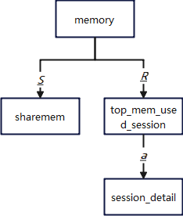

##### 	b. 页面

```
┌───────────────────────────────────────────────────────────────────────────────────────────────────────────────────────────────────────────────────────────────────────────────────────────────────────────────────┐
│                                                                                                                                                                                                                   │
│                              process_memory_used_percent     : >>>>>>>>>>>>>>>>>>>>>>>>>>>>>>>>>>69.32%                                                                                                           │
│                              dynamic_memory_used_percent     : >>>>>>>>>>>>>>>>>35.01%                                                                                                                            │
│                              backend_memory_used_percent     : 0.15%                                                                                                                                              │
│                              shared_memory_used_percent      : >>>>>>>>>>>>>>>>>>>>>>>>>>>>>>>>>>>>>>>>>>>>>>>>>99.96%                                                                                            │
│                              cstore_memory_used_percent      : 0.00%                                                                                                                                              │
│                              sctpcomm_memory_used_percent    : 0.00%                                                                                                                                              │
│                              gpu_dynamic_memory_used_percent : 0.00%                                                                                                                                              │
│                                                                                                                                                                                                                   │
│___________________________________________________________________________________________________________________________________________________________________________________________________________________│
│target_ip: 197.0.3.106        max_process_memory: 27648     process_used_memory: 19166    max_dynamic_memory: 13965      dynamic_used_memory: 4889     dynamic_used_shrctx: 2258      max_backend_memory: 660      │
│                                                                                                                                                                                                                   │
│backend_used_memory: 1        max_shared_memory: 12990      shared_used_memory: 12985     max_cstore_memory: 32          cstore_used_memory: 0         max_sctpcomm_memory: 0         sctpcomm_used_memory: 0      │
│                                                                                                                                                                                                                   │
│other_used_memory: 1237       gpu_max_dynamic_memory: 0     gpu_dynamic_used_memory: 0    pooler_conn_memory: 0          pooler_freeconn_memory: 0     storage_compress_memory: 0     udf_reserved_memory: 0       │
│                                                                                                                                                                                                                   │
```

**页面指标**：

| 指标                            | 描述                          |
| ------------------------------- | ----------------------------- |
| process_memory_used_percent     | 进程内存占用百分比            |
| dynamic_memory_used_percent     | 动态内存占用百分比            |
| backend_memory_used_percent     | backend内存占用百分比         |
| shared_memory_used_percent      | 共享内存占用百分比            |
| cstore_memory_used_percent      | 列存占用百分比                |
| sctpcomm_memory_used_percent    | sctp通信内存占用百分比        |
| gpu_dynamic_memory_used_percent | GPU内存占用百分比             |
| target_ip                       | IP                            |
| max_process_memory              | openGauss实例所占用的内存大小 |
| process_used_memory             | 进程所使用的内存大小          |
| max_dynamic_memory              | 最大动态内存                  |
| dynamic_used_memory             | 已使用的动态内存              |
| dynamic_used_shrctx             | 最大动态共享内存上下文        |
| max_backend_memory              | 最大后端内存                  |
| backend_used_memory             | 已使用的后端内存              |
| max_shared_memory               | 最大共享内存                  |
| shared_used_memory              | 已使用的共享内存              |
| max_cstore_memory               | 列存所允许使用的最大内存      |
| cstore_used_memory              | 列存已使用的内存大小          |
| max_sctpcomm_memory             | sctp通信所允许使用的最大内存  |
| sctpcomm_used_memory            | sctp通信已使用的内存大小      |
| other_used_memory               | 其他已使用的内存大小          |
| gpu_max_dynamic_memory          | GPU最大动态内存               |
| gpu_dynamic_used_memory         | GPU已使用的动态内存           |
| pooler_conn_memory              | 连接池申请内存计数            |
| pooler_freeconn_memory          | 连接池空闲连接的内存计数      |
| storage_compress_memory         | 存储模块压缩使用的内存大小    |
| udf_reserved_memory             | UDF预留的内存大小             |

##### 		c. 快捷键

| 键位 | 功能                         | 范围           | 说明                                            |
| ---- | ---------------------------- | -------------- | ----------------------------------------------- |
| S    | 前往sharemem页面             | memory页面支持 | 页面显示为内存相关信息，已根据usedsizee倒叙排序 |
| R    | 前往top_mem_used_session页面 | memory页面支持 | 页面显示为session内存使用排行                   |

#### 2）sharemem

```
memory >> sharemem
```

展示共享内存：

```
┌───────────────────────────────────────────────────────────────────────────────────────────────────────────────────────────────────────────────────────────────────────────────────────────────────────────────────┐
│                                                                                                                                                                                                                   │
│                                                                                 data_length: 4084                                                                                                                 │
│___________________________________________________________________________________________________________________________________________________________________________________________________________________│
│parent                        contextname                   level                         totalsize                      freesize                      usedsize                       usedsize/totalsize           │
│___________________________________________________________________________________________________________________________________________________________________________________________________________________│
│GlobalSysDBCacheEntryMemCxt_2 system_model_pm_storageportpr 4                             3392                           0                             3392                           100.0                        │
│454192                        f                                                                                                                                                                                    │
│ProcessMemory                 PercentileContext             1                             2400088                        0                             2400088                        100.0                        │
│UniqueSQLContext              unique sql hash table         2                             968634816                      12864                         968621952                      100.0                        │
│ProcessMemory                 Undo                          1                             131328                         0                             131328                         100.0                        │
│GlobalSysDBCacheEntryMemCxt_2 system_model_pm_lungroup      4                             3392                           0                             3392                           100.0                        │
│454192                                                                                                                                                                                                             │
│GlobalSysDBCacheEntryMemCxt_2 system_model_pm_storagediskpr 4                             3392                           0                             3392                           100.0                        │
│454192                        f                                                                                                                                                                                    │
│GlobalSysDBCacheEntryMemCxt_2 system_model_pm_switchportprf 4                             3392                           0                             3392                           100.0                        │
│454192                                                                                                                                                                                                             │
│GlobalSysDBCacheEntryMemCxt_2 system_model_pm_controllerprf 4                             3392                           0                             3392                           100.0                        │
│454192                                                                                                                                                                                                             │
│GlobalSysDBCacheEntryMemCxt_2 system_model_pm_storageprf    4                             3392                           0                             3392                           100.0                        │
│454192                                                                                                                                                                                                             │
│GlobalSysDBCacheEntryMemCxt_2 system_model_pm_storagevolume 4                             3392                           0                             3392                           100.0                        │
│454192                        prf                                                                                                                                                                                  │
│StorageTopMemoryContext       IncreCheckPointContext        2                             100537072                      2864                          100534208                      100.0                        │
│Operator resource track       operator collector hash table 3                             22823552                       560                           22822992                       100.0                        │
│memory context                                                                                                                                                                                                     │
│GlobalSysDBCacheEntryMemCxt_2 system_model_pm_switchprf     4                             3392                           0                             3392                           100.0                        │
│454192                                                                                                                                                                                                             │
│AshContext                    ASP unique sql hash table     2                             161069152                      12736                         161056416                      99.99                        │
```

**页面指标**：

| 指标               | 描述                           |
| ------------------ | ------------------------------ |
| parent             | root level的内存上下文名称     |
| contextname        | 内存上下文名称                 |
| level              | 内存上下文的级别               |
| totalsize          | 共享内存总大小（单位：字节）   |
| freesize           | 共享内存剩余大小（单位：字节） |
| usedsize           | 共享内存使用大小（单位：字节） |
| usedsize/totalsize | 共享内存已使用的百分比         |

#### 3）top_mem_used_session

```
memory >> top_mem_used_session
```

用于展示消耗内存最大的session

##### 	b. 页面

```
│pid                           init_mem                      used_mem                      peak_mem                       query                         usename                        client_addr                  │
│___________________________________________________________________________________________________________________________________________________________________________________________________________________│
│140602345850624               4                             22                            22                             SELECT SNAPTIME AS SNAPTIME,  mlausr                         197.0.35.121                 │
│                                                                                                                                                                                                                   │
│140598914971392               2                             2                             2                              -                             ogtop                          197.0.199.12                 │
│140607740507904               2                             2                             2                              -                             ogtop                          197.0.199.12                 │
│140596063303424               2                             2                             2                              -                             ogtop                          197.0.199.12                 │
│140595234797312               2                             2                             2                              -                             ogtop                          197.0.199.12                 │
```

**页面指标**：

| 指标        | 描述                                                 |
| ----------- | :--------------------------------------------------- |
| pid         | 线程ID                                               |
| init_mem    | 当前正在执行作业进入执行器前已分配的内存（单位：MB） |
| used_mem    | 当前正在执行作业已分配的内存（单位：MB）             |
| peak_mem    | 当前正在执行作业已分配的内存峰值（单位：MB）         |
| query       | SQL                                                  |
| usename     | 用户名                                               |
| client_addr | 客户端地址                                           |

##### 		c. 快捷键

| 键位 | 功能                | 范围                         | 说明                                                    |
| ---- | ------------------- | ---------------------------- | ------------------------------------------------------- |
| a    | 前往session详情页面 | top_mem_used_session页面支持 | 复制需要查询的top_mem_used_session的pid，输入到提示框内 |

### 9、Dynamicsql - 动态SQL

从ogtop工具任意界面，使用键盘`D`键进入本页面，支持查看SQL的耗时情况

#### 	a. 流程图

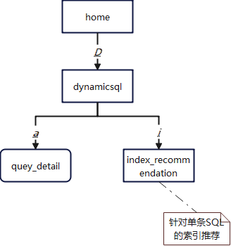

#### 	b. 页面

```
│___________________________________________________________________________________________________________________________________________________________________________________________________________________│
│unique_sql_id              query                     user_name                  data_io_time(s)           avg_db_time(s)             n_calls                   db_time(s)                 cpu_time(s)              │
│___________________________________________________________________________________________________________________________________________________________________________________________________________________│
│3499382993                 select * from             mlausr                     0.0131                    0.0033                     1265.0                    4.233                      3.605                    │
│                           JMX_KAFKA_PERFOR                                                                                                                                                                        │
│3892820142                 select                    ogtop                      0.0                       3.5171                     1.0                       3.5171                     3.1441                   │
│                               user_name,                                                                                                                                                                          │
│                               uni                                                                                                                                                                                 │
```

**页面指标**：

| 指标                         | 描述                                   |
| ---------------------------- | -------------------------------------- |
| unique_sql_id                | 归一化的SQL ID                         |
| query                        | 归一化的SQL                            |
| user_name                    | 用户名                                 |
| data_io_time                 | IO 上的时间花费（单位：秒）            |
| avg_db_time                  | 平均db时间花费（单位：秒）             |
| n_calls                      | 调用次数                               |
| db_time                      | db时间花费（单位：秒）                 |
| cpu_time                     | CPU 时间（单位：秒）                   |
| execution_time               | 执行器内执行时间                       |
| parse_time                   | SQL解析时间                            |
| plan_time                    | SQL生成计划时间                        |
| total_elapse_time            | SQL在内核没得总运行时间                |
| n_returned_rows              | SELECT返回的结果集行数                 |
| n_tuples_fetched             | 随机扫描行                             |
| n_tuples_returned            | 顺序扫描行                             |
| n_tuples_inserted            | 插入行                                 |
| n_tuples_updated             | 更新行                                 |
| n_tuples_deleted             | 删除行                                 |
| n_blocks_fetched             | buffer的块访问次数                     |
| n_blocks_hit                 | buffer的块命中次数                     |
| n_soft_parse                 | 软解析次数                             |
| n_hard_parse                 | 硬解析次数                             |
| rewrite_time(s)              | SQL重写时间                            |
| pl_execution_time(s)         | plpgsql上的执行时间                    |
| pl_compilation_time(s)       | plpgsql上的编译时间                    |
| net_send_info_time           | 通过物理连接发送消息的时间             |
| net_send_info_n_calls        | 通过物理连接发送消息的调用次数         |
| net_send_info_size           | 通过物理连接发送消息的吞吐量           |
| net_recv_info_time           | 通过物理连接接收消息的时间             |
| net_recv_info_n_calls        | 通过物理连接接收消息的调用次数         |
| net_recv_info_size           | 通过物理连接接收消息的吞吐量           |
| net_stream_send_info_time    | 通过逻辑连接发送消息的时间             |
| net_stream_send_info_n_calls | 通过逻辑连接发送消息的调用次数         |
| net_stream_send_info_size    | 通过逻辑连接发送消息的吞吐量           |
| net_stream_recv_info_time    | 通过逻辑连接接收消息的时间             |
| net_stream_recv_info_n_calls | 通过逻辑连接接收消息的调用次数         |
| net_stream_recv_info_size    | 通过逻辑连接接收消息的吞吐量           |
| sort_count                   | 排序执行的次数                         |
| sort_time(s)                 | 排序执行的时间                         |
| sort_mem_used                | 排序过程中使用的work memory大小        |
| sort_spill_count             | 排序过程中，若发生落盘，写文件的次数   |
| sort_spill_size              | 排序过程中，若发生落盘，使用的文件大小 |
| hash_count                   | hash执行的次数                         |
| hash_time(s)                 | hash执行的时间                         |
| hash_mem_used                | hash过程中使用的work memory大小        |
| hash_spill_count             | hash过程中，若发生落盘，写文件的次数   |
| hash_spill_size              | hash过程中，若发生落盘，使用的文件大小 |

#### 	c. 快捷键

| 键位 | 功能             | 范围               | 说明                     |
| ---- | ---------------- | ------------------ | ------------------------ |
| a    | 查看query详情    | dynamicsql页面支持 | 用于查看query中的sql详情 |
| i    | dbmind的索引推荐 | dynamicsql页面支持 | 用于查看query的索引推荐  |

```
dynamicsql >> query_detail
```

输入键盘`a`，可查看某条具体的SQL ：

```
┌───────────────────────────────────────────────────────────────────────────────────────┐
│ please input unique_sql_id(end with enter):                                            │
└───────────────────────────────────────────────────────────────────────────────────────┘

┌───────────────────────────────────────────────────────────────────────────────────────┐
│select count(*) from index_test ;                                                      │
```

输入键盘`i`，可查看所有SQL的索引推荐：

```
┌───────────────────────────────────────────────────────────────────────────────────────┐
│ please input unique_sql_id(end with enter):                                            │
└───────────────────────────────────────────────────────────────────────────────────────┘

┌───────────────────────────────────────────────────────────────────────────────────────────────────────────────────────────────────────────────────────────────────────────────────────────────────────────────────┐
│                                                                                                                                                                                                                   │
│advised_indexes                                                                                                                                                                                                    │
│___________________________________________________________________________________________________________________________________________________________________________________________________________________│
│advised_indexe0：                                                                                                                                                                                                  │
│    indexdef：CREATE INDEX idx_test1_1_c5 ON public.test1_1(c5);                                                                                                                                                   │
│    workload_benefit：1198740.21                                                                                                                                                                                   │
│    workload_improved_rate：0.9728904450429643                                                                                                                                                                     │
│    useless_indexes：                                                                                                                                                                                              │
│    existing_indexes：                                                                                                                                                                                             │
│    improved_queriies：                                                                                                                                                                                            │
│      query：select c1,c2 from test1_1 where c5=?;                                                                                                                                                                 │
│      query_benefit：1198740.21                                                                                                                                                                                    │
│      query_improved_rate：35.88736320403798                                                                                                                                                                       │
│      query_count：1                                                                                                                                                                                               │
│      origin_plan：                                                                                                                                                                                                │
│                  Seq Scan on test1_1  (cost=0.00..1232143.06 rows=10997 width=8)                                                                                                                                  │
│                    Filter: (c5 = $1)                                                                                                                                                                              │
│      current_plan：                                                                                                                                                                                               │
│                   Index Scan using <2115985011>btree_test1_1_c5 on test1_1  (cost=0.00..33402.85 rows=10997 width=8)                                                                                              │
│                     Index Cond: (c5 = $1)                                                                                                                                                                         │
│      other_related_indexes：                                                                                                                                                                                      │
```

### 10、Lock - 锁

lock模块可查看数据库中锁的所有信息，也可通过lock_chain页面查看session锁阻塞的具体情况

#### 1）Lock 主页面

登陆ogtop任意界面，按`U`键进入lock锁模块，可查看数据库中的锁信息

##### 		a. 流程图

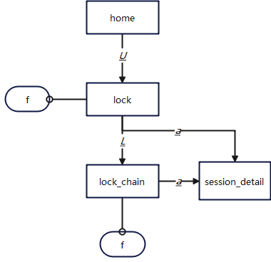

##### 		b. 页面

```
┌───────────────────────────────────────────────────────────────────────────────────────────────────────────────────────────────────────────────────────────────────────────────────────────────────────────────────┐
│                                                                                                                                                                                                                   │
│                                                                                 data_length: 76                                                                                                                   │
│___________________________________________________________________________________________________________________________________________________________________________________________________________________│
│pid                        locktype                  database                   relname                   page                       tuple                     transactionid              virtualxid               │
│___________________________________________________________________________________________________________________________________________________________________________________________________________________│
│140604110010112            relation                  ogtop                      lock_test_pkey            0                          0                         0                          0                        │
│140604110010112            relation                  ogtop                      lock_test                 0                          0                         0                          0                        │
│140603423258368            relation                  ogtop                      lock_test_pkey            0                          0                         0                          0                        │
│140603423258368            relation                  ogtop                      lock_test                 0                          0                         0                          0                        │
│140613929182976            relation                  ogtop                      pg_database_oid_index     0                          0                         0                          0                        │
│140613929182976            relation                  ogtop                      pg_database_datname_index 0                          0                         0                          0                        │
│140613929182976            relation                  ogtop                      pg_class_tblspc_relfileno 0                          0                         0                          0                        │
│                                                                                de_index                                                                                                                           │
│140613929182976            relation                  ogtop                      pg_class_relname_nsp_inde 0                          0                         0                          0                        │
│                                                                                x                                                                                                                                  │
│140613929182976            relation                  ogtop                      pg_class_oid_index        0                          0                         0                          0                        │
│140613929182976            relation                  ogtop                      pg_database               0                          0                         0                          0                        │
│140613929182976            relation                  ogtop                      stat_database             0                          0                         0                          0                        │
│140613929182976            relation                  ogtop                      pg_class                  0                          0                         0                          0                        │
│140613929182976            relation                  ogtop                      locks                     0                          0                         0                          0                        │
│140599254472448            relation                  ogtop                      lock_test_pkey            0                          0                         0                          0                        │
│140599254472448            relation                  ogtop                      lock_test                 0                          0                         0                          0                        │
│140599254472448            tuple                     ogtop                      lock_test                 0.0                        1.0                       0                          0                        │
│140603423258368            tuple                     ogtop                      lock_test                 0.0                        1.0                       0                          0                        │
```

**页面指标**：

| 指标               | 描述                                                         |
| ------------------ | ------------------------------------------------------------ |
| data_length        | 查询的数据总条数                                             |
| pid                | 线程id                                                       |
| locktype           | 被锁定对象的类型                                             |
| database           | 被锁定对象所在的数据库                                       |
| relname            | 表名                                                         |
| page               | 表内部的页面编号                                             |
| tuple              | 页面里的行编号                                               |
| transactionid      | 事务ID                                                       |
| virtualxid         | 虚拟事务ID                                                   |
| objid              | 对象在其系统表的OID                                          |
| virtualtransaction | 持有此锁或者在等待此锁的虚拟事务ID                           |
| mode               | 该线程持有的或者期望的锁模式                                 |
| granted            | 持有锁：TRUE<br>等待锁：FALSE                                |
| fastpath           | 如果通过fast-path获得锁，则为TRUE；如果通过主要的锁表获得，则为FALSE。 |
| locktag            | 会话等待锁信息，可通过locktag_decode()函数解析。             |

##### 		c. 快捷键

| 键位 | 功能                | 范围         | 说明                                                         |
| ---- | ------------------- | ------------ | ------------------------------------------------------------ |
| L    | 前往lock_chain页面  | lock页面支持 | 显示数据库中的锁阻塞，页面显示分别为持有者的pid和申请者的pid |
| a    | 前往session详情页面 | lock页面支持 | 复制需要查询的lock的pid，输入到提示框内                      |
| f    | Kill session        | lock页面支持 | 使用功能时需仔细确认选中pid是否为需要kill的session的pid      |

#### 2）lock_chain

```
lock >> lock_chain
```

展示选定的blockerhholder（锁持有者session id） >>>  ock_blocked_agent_id（锁申请者session id）

##### 	a. 页面

```
┌───────────────────────────────────────────────────────────────────────┐
│                                                                       │
│     blocker_holder  >>>  lock_blocked_agent_id                         │
│_______________________________________________________________________│
│     140604110010112  >>>  140603423258368                             │
│     140603423258368  >>>  140599254472448                             │
```

##### 	b. 快捷键

| 键位 | 功能                | 范围               | 说明                                                    |
| ---- | ------------------- | ------------------ | ------------------------------------------------------- |
| a    | 前往session详情页面 | lock_chain页面支持 | 复制需要查询的lock的pid，输入到提示框内                 |
| f    | Kill session        | lock_chain页面支持 | 使用功能时需仔细确认选中pid是否为需要kill的session的pid |

Kill 140604110010112 ，第一个锁阻塞消失，窗口二，update成功

```
┌──────────────────────────────────────────────────────────────────┐
│please enter pid to delete(end with enter):                        │       

┌──────────────────────────────────────────────────────────────────┐
│                                                                  │
│     blocker_holder  >>>  lock_blocked_agent_id                    │
│__________________________________________________________________│
│     140603423258368  >>>  140599254472448                        │
```

### 11、wait_event - 等待事件

进入ogtop任意界面，按`W`键进入等待事件模块，可观察数据库中的等待事件的概览情况

#### 		a. 流程图


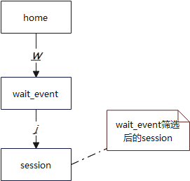

#### 		b. 页面

```
┌───────────────────────────────────────────────────────────────────────────────────────────────────────────────────────────────────────────────────────────────────────────────────────────────────────────────────┐
│                                                                                                                                                                                                                   │
│                                                                                 data_length: 366                                                                                                                  │
│___________________________________________________________________________________________________________________________________________________________________________________________________________________│
│nodename             type                 event                wait                 failed_wait          total_wait_time(ms)  avg_wait_time(ms)     history_max_wait_tim history_min_wait_time last_updated        │
│                                                                                                                                                    e(ms)                (ms)                                      │
│___________________________________________________________________________________________________________________________________________________________________________________________________________________│
│dn_6001              STATUS               wait wal sync        2877                 0                    1771.447             0.6157271463          6091.629             0.001                 2024-01-19 14:55:09.│
│                                                                                                                                                                                               493818+08:00        │
│dn_6001              LWLOCK_EVENT         WALFlushWait         1737                 0                    794.901              0.4576286701          520.338              0.001                 2024-01-19 14:55:09.│
│                                                                                                                                                                                               493198+08:00        │
│dn_6001              IO_EVENT             DataFileRead         73342                0                    610.223              0.0083202394          526.752              0.001                 2024-01-19 14:55:09.│
│                                                                                                                                                                                               492792+08:00        │
│dn_6001              IO_EVENT             BufHashTableSearch   550698               0                    587.506              0.0010668388          60.775               0.001                 2024-01-19 14:55:09.│
│                                                                                                                                                                                               493085+08:00        │
│dn_6001              STATUS               flush data           13489                0                    436.415              0.0323533991          26485.892            0.001                 2024-01-19 14:55:09.│
│                                                                                                                                                                                               495041+08:00        │
```

**页面指标**：

| 指标                      | 描述                                |
| ------------------------- | ----------------------------------- |
| nodename                  | 数据库进程名称                      |
| type                      | event类型：IO、LOCK、LWLOCK、STATUS |
| event                     | event名称                           |
| wait                      | 等待次数                            |
| failed_wait               | 失败的等待次数                      |
| total_wait_time(ms)       | 总等待时间                          |
| avg_wait_time(ms)         | 平均等待时间                        |
| history_max_wait_time(ms) | 最大等待时间                        |
| history_min_wait_time(ms) | 最小等待时间                        |
| last_updated              | 最后一次更新该事件的时间            |

#### 		c. 快捷键

| 键位 | 功能                                | 范围               | 说明                                                         |
| ---- | ----------------------------------- | ------------------ | ------------------------------------------------------------ |
| j    | 筛选指定的等待事件，进入session界面 | wait_event页面支持 | 在悬浮窗内输入需要查询的关键字，跳转到session页面，并根据输入的关键字进行模糊查询。相当于session页面进行模糊查询 |

```
┌────────────────────────────────────────────────────────────────┐
│please input event to sort in session page(end with enter):      │
```

跳转到session界面，并根据输入的关键字进行模糊查询

例如输入`wait cmd`，显示

```
│pid                        query                     current_state              xact_start_time(ms)       query_start_time(ms)       waiting                   wait_status                wait_event               │
│___________________________________________________________________________________________________________________________________________________________________________________________________________________│
│140578946086656            insert into mlausr.OS_OS_ active                     460.709                   460.712                    False                     wait cmd                   wait cmd                 │
│                           PERFORMANCE(host,target_i                                                                                                                                                               │
│                           p,snaptime                                                                                                                                                                              │
│140607252068096               INSERT INTO OG_STATEME active                     484.25                    484.252                    False                     wait cmd                   wait cmd                 │
│                           NT_ORIGINAL_DATA                                                                                                                                                                        │
│                           (target_ip, snapti                                                                                                                                                                      │
│140593811085056            select * from             active                     495.436                   495.439                    False                     wait cmd                   wait cmd                 │
│                           JMX_KAFKA_PERFORMANCE                                                                                                                                                                   │
│                           where host= '197.0.192.4                                                                                                                                                                │
```

### 12、Replication - 流复制

该模块监控数据库流复制以及复制操的各项状态指标。进入ogtop任意界面后按`r`进入查看该模块的功能。

#### 	a. 流程图

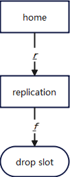


#### 	b. 页面

```
┌───────────────────────────────────────────────────────────────────────────────────────────────────────────────────────────────────────────────────────────────────────────────────────────────────────────────────┐
│                                                                                                                                                                                                                   │
│channel                 local_role              peer_role              peer_state              sync_percent           sync_state              receive_gap(kb)        replay_gap(kb)          sender_sent_location(k│
│                                                                                                                                                                                             b/s)                  │
│___________________________________________________________________________________________________________________________________________________________________________________________________________________│
│197.0.3.106:26001-->197 Primary                 Standby                Normal                  100%                   Sync                    0.0                    0.3046875               801.57421875          │
│.0.3.107:34126                                                                                                                                                                                                     │
│                                                                                                                                                                                                                   │
│___________________________________________________________________________________________________________________________________________________________________________________________________________________│
│channel                 local_role              sender_write_location( sender_flush_location(k sender_replay_location receiver_received_locat receiver_write_locatio receiver_flush_location receiver_replay_locati│
│                                                kb/s)                  b/s)                    (kb/s)                 ion(kb/s)               n(kb/s)                (kb/s)                  on(kb/s)              │
│___________________________________________________________________________________________________________________________________________________________________________________________________________________│
│197.0.3.106:26001-->197 Primary                 801.57421875           801.57421875            801.57421875           801.57421875            801.57421875           801.57421875            803.9765625           │
│.0.3.107:34126                                                                                                                                                                                                     │
│                                                                                                                                                                                                                   │
│                                                                                                                                                                                                                   │
│                                                             slots                                                                                                                                                 │
│___________________________________________________________________________________________________________________________________________________________________________________________________________________│
│___________________________________________________________________________________________________________________________________________________________________________________________________________________│
│slot_name            plugin               slot_type            datname              active               catalog_xmin         restart_lsn           diff_lsn             dummy_standby         confirmed_flush     │
│                                                                                                                                                                                                                   │
│___________________________________________________________________________________________________________________________________________________________________________________________________________________│
│og_197_20_186_250    -                    physical             -                    False                0                    35469223701704.0      146873771800.0       False                 -                   │
│dn_6001              -                    physical             -                    True                 0                    35616097472944.0      560.0                False                 12B3/B55A5758       │
│                                                                                                                                                                                                                   │
```

**页面指标**：

| 指标                             | 描述                                                     |
| -------------------------------- | -------------------------------------------------------- |
| channel                          | walsender信道信息                                        |
| local_role                       | 本地角色                                                 |
| peer_role                        | 对端角色                                                 |
| peer_state                       | 对端状态                                                 |
| sync_percent                     | 同步百分比                                               |
| sync_state                       | 同步状态                                                 |
| receive_gap(kb)                  | 日志接收延迟                                             |
| replay_gap(kb)                   | 备库replay xlog的延迟                                    |
| sender_sent_location(kb/s)       | 发送端日志发送位置                                       |
| sender_write_location(kb/s)      | 发送端日志写入位置                                       |
| sender_flush_location(kb/s)      | 发送端日志刷新位置                                       |
| sender_replay_location(kb/s)     | 发送端日志重放位置                                       |
| receiver_received_location(kb/s) | 接收端日志接受位置                                       |
| receiver_write_location(kb/s)    | 接收端日志写入位置                                       |
| receiver_flush_location(kb/s)    | 接收端日志刷新位置                                       |
| receiver_replay_location(kb/s)   | 接收端日志重放位置                                       |
| <b>slots复制槽</b>               |                                                          |
| slot_name                        | 复制槽名称                                               |
| plugin                           | 逻辑复制槽对应的输出插件名                               |
| slot_type                        | 复制槽的类型                                             |
| datname                          | 复制槽所在的数据库名称                                   |
| active                           | 复制槽的状态                                             |
| catalog_xmin                     | 数据库须为逻辑复制槽保留的最早的涉及系统表的事务的事务号 |
| restart_lsn                      | 复制槽需要的最早xlog的物理位置                           |
| diff_lsn                         | 对于当前xlog，延迟的lsn                                  |
| dummy_standby                    | 复制槽的连接对端是否为从备                               |
| confirmed_flush                  | 客户端确认接收到的日志位置                               |

#### c. 快捷键

| 键位 | 功能           | 范围                | 说明                                                |
| ---- | -------------- | ------------------- | --------------------------------------------------- |
| f    | 删除指定复制槽 | replication页面支持 | 在悬浮窗内输入需要删除的slot_name，删除指定的复制槽 |

### 13、database_list

登陆ogtop任意界面，按`l`键进入database_list模块，查看当前集群的datalese 列表

```
┌───────────────────────────────────────────────────────────────────────────────────────────────────────────────────────────────────────────────────────────────────────────────────────────────┐
│datname              numbackends          xact_commit          xact_rollback         blks_read            blks_hit              tup_returned         tup_fetched           tup_inserted        │
│_______________________________________________________________________________________________________________________________________________________________________________________________│
│lmj                  0                    2912419              5                     696232               63445924              403237743            50117360              1                   │
│mladb                431                  9491557224           4291983               241195160825         574586288681          6643936909381        37812746767           17216869171         │
│ogtop                0                    2912508              5                     667602               68971344              452398681            60490988              1                   │
│postgres             9                    9953375              242621                138703849            4301461309            7184838752           5010232296            7612478             │
│template0            0                    17112                2                     218470               1525420               19978952             4300                  0                   │
│template1            0                    237518               2                     293842               50829511              335378502            41840112              0                   │
│test1                0                    2912393              5                     633405               63510423              403258429            50120000              0                   │
│test_mladb           1                    2912794              6                     831922               56819805              665215479            54480394              1                   │
```
**页面指标**：

| 指标                             | 描述                                                     |
| -------------------------------- | -------------------------------------------------------- |
| datname                          |  这个数据库的名称                                        |
| numbackends                      | 前连接到该数据库的后端数。这是在返回一个反映目前状态值的视图中唯一的列；自上次重置所有其他列返回累积值。                                                  |
| xact_commit                      | 此数据库中已经提交的事务数                                                 |
| xact_rollback                    | 此数据库中已经回滚的事务数                                                 |
| blks_read                        | 在这个数据库中读取的磁盘块的数量                                               |
| blks_hit                         | 高速缓存中已经发现的磁盘块的次数， 这样读取是不必要的（这只包括openGauss缓冲区高速缓存，没有操作系统的文件系统缓存）。                                                 |
| tup_returned                     | 过数据库查询返回的行数                                             |
| tup_fetched                      | 通过数据库查询抓取的行数                                    |
| tup_inserted                     | 通过数据库查询插入的行数                                       |
| tup_updated                      | 通过数据库查询更新的行数                                       |
| tup_deleted                      | 通过数据库查询删除的行数                                       |
| conflicts                        | 由于数据库恢复冲突取消的查询数量（只在备用服务器发生的冲突）                                       |
| temp_files                       | 通过数据库查询创建的临时文件数量。计算所有临时文件， 不论为什么创建临时文件（比如排序或者哈希）， 而且不管log_temp_files设置                                       |
| temp_bytes                       | 通过数据库查询写入临时文件的数据总量。计算所有临时文件，不论为什么创建临时文件，而且不管log_temp_files设置。                                       |
| deadlocks                        | 在该数据库中检索的死锁数                                       |
| blk_read_time                    | 通过数据库后端读取数据文件块花费的时间，以毫秒计算。                                       |
| blk_write_time                   | 通过数据库后端写入数据文件块花费的时间，以毫秒计算。                                       |
| stats_reset                      | 重置当前状态统计的时间。                                                          |

### 14、sql_patch

登陆ogtop任意界面，按`P`键进入sql_patch模块。该页面监控SQL PATCH的状态，提供创建Abort Patch的功能，同样支持删除某个指定的PATCH

#### a. 流程图

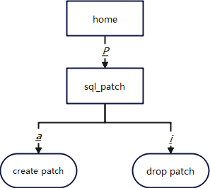


#### b. 页面

```
│patch_name                 unique_sql_id             username                   enable                    status                     abort                     hint_string                hint_node                │
│___________________________________________________________________________________________________________________________________________________________________________________________________________________│
│hint_patch_0129            3480341777                omm                        False                     d                          False                     tablescan(sql_patch_test)  {HINTSTATE :nall_hints 1 │
│                                                                                                                                                                                          :join_hint <>            │
│                                                                                                                                                                                          :leading_hint <>         │
│                                                                                                                                                                                          :row_hint <> :stream_hint│
│                                                                                                                                                                                          <> :block_name_hint <>   │
│                                                                                                                                                                                          :scan_hint ({SCANHINT    │
│                                                                                                                                                                                          :relnames                │
│                                                                                                                                                                                          ("sql_patch_test")       │
│                                                                                                                                                                                          :hint_keyword 8 :state 0 │
│                                                                                                                                                                                          :negative false :relid   │
│                                                                                                                                                                                          (b) :indexlist <>})      │
│                                                                                                                                                                                          :skew_hint <>            │
│                                                                                                                                                                                          :predpush_hint <>        │
│                                                                                                                                                                                          :rewrite_hint <>         │
│                                                                                                                                                                                          :gather_hint <>          │
│                                                                                                                                                                                          :no_expand_hint <>       │
│                                                                                                                                                                                          :set_hint <>             │
│                                                                                                                                                                                          :cache_plan_hint <>      │
│                                                                                                                                                                                          :no_gpc_hint <>          │
│                                                                                                                                                                                          :predpush_same_level_hint│
│                                                                                                                                                                                          <> :from_sql_patch true  │
│                                                                                                                                                                                          :material_subplan_hint   │
│                                                                                                                                                                                          <>}                      │
```

**页面指标**：

| 指标                | 描述                    |
| ------------------- | ----------------------- |
| patch_name          | patch 名称              |
| unique_sql_id       | 查询全局唯一ID          |
| username            | PATCH 创建的用户名      |
| enable              | PATCH是否生效           |
| status              | PATCH的状态             |
| abort               | 是否是ABORT PATCH       |
| hint_string         | HINT文本                |
| hint_node           | HINT解析&序列化的结果   |
| original_query      | 原始语句PATCH之后的语句 |
| original_query_tree | 原始语句的解析结果      |
| patched_query       | PATCH之后的语句         |
| patched_query_tree  | PATCH之后语句的解析结果 |
| description         | PATCH的备注             |

#### c. 快捷键

| 键位 | 功能       | 范围              | 说明                                              |
| ---- | ---------- | ----------------- | ------------------------------------------------- |
| a    | 创建 patch | sql_patch页面支持 | 在悬浮窗内输入需要创建的patch name，unique_sql_id |
| f    | 删除patch  | sql_patch页面支持 | 在悬浮窗内输入需要删除的patch的名称               |

创建patch：

```
┌─────────────────────────────────────────────────────────┐
│please input patchname uniquesqlid(end with enter):      │

┌──────────────────────────────────────────────────────────────────────────────────────────────────────────────────────────────────────────────────────────────────────────────────────────────────────────────────┐
│patch_name                 unique_sql_id             username                   enable                    status                     abort                     hint_string                hint_node                │
│abort_patch_0130           1146060977                ogtop                      True                      d                          True                      -                          -                        │
```

删除patch：

```
┌──────────────────────────────────────────────────┐ 
│please input patchname (end with enter):          │
```


### 15、slow_sql - 慢SQL

登陆ogtop任意界面，按`B`键进入slow_sql模块。该页面的数据来自dbe_perf.statement_history，提供根据start_time筛选指定时间段开始的慢SQL。

#### a. 流程图

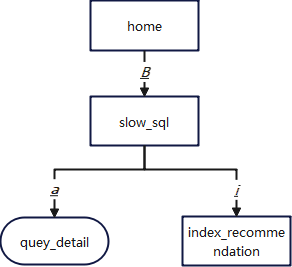

#### b. 页面


```
┌───────────────────────────────────────────────────────────────────────────────────────────────────────────────────────────────────────────┐
│please enter what to find(year-month-day hour:minute:second~year-month-day hour:minute:second):2024-01-29 10:00:00~2024-01-29 11:00:00     │

│session_id                 query                     unique_query_id            debug_query_id            duration_ms                db_name                   user_name                  application_name         │
│___________________________________________________________________________________________________________________________________________________________________________________________________________________│
│139751773038336            merge into MLAUSR.JMX_KAF 370564396                  4785075326422909          1458.794                   mladb                     mlausr                     mlausr                   │
│                           KA_CONSUME_PERFORMANCE_SU                                                                                                                                                               │
│                           MMARY as P                                                                                                                                                                              │
│139751903786752            merge into MLAUSR.JMX_KAF 370564396                  4785075326422913          1456.615                   mladb                     mlausr                     mlausr                   │
│                           KA_CONSUME_PERFORMANCE_SU                                                                                                                                                               │
│                           MMARY as P                                                                                                                                                                              │
```

**页面指标**：

| 指标                         | 描述                                                         |
| ---------------------------- | ------------------------------------------------------------ |
| session_id                   | 会话ID                                                       |
| query                        | 归一化的SQL                                                  |
| unique_query_id              | 归一化SQL ID                                                 |
| debug_query_id               | 唯一SQL ID                                                   |
| db_name                      | 数据库名称                                                   |
| user_name                    | 用户名                                                       |
| application_name             | 用户发起的请求的应用程序名称                                 |
| client_addr                  | 用户发起的请求的客户端地址                                   |
| duration_ms                  | 语句的执行时间                                               |
| n_soft_parse                 | 软解析次数                                                   |
| n_hard_parse                 | 硬解析次数                                                   |
| query_plan                   | 语句执行计划                                                 |
| n_returned_rows              | SELECT返回的结果集行数                                       |
| n_tuples_fetched             | 随机扫描行                                                   |
| n_tuples_returned            | 顺序扫描行                                                   |
| n_tuples_inserted            | 插入行                                                       |
| n_tuples_updated             | 更新行                                                       |
| n_tuples_deleted             | 删除行                                                       |
| n_blocks_fetched             | buffer的块访问次数                                           |
| n_blocks_hit                 | buffer的块命中次数                                           |
| db_time(s)                   | 有效时间花费，多线程将累加                                   |
| cpu_time(s)                  | CPU时间                                                      |
| execution_time(s)            | 执行器内执行时间                                             |
| data_io_time(s)              | IO上的时间花费                                               |
| parse_time(s)                | SQL解析时间                                                  |
| plan_time(s)                 | SQL生成计划时间                                              |
| rewrite_time                 | SQL重写时间                                                  |
| pl_execution_time            | plpgsql上的执行时间                                          |
| pl_compilation_time          | plpgsql上的编译时间                                          |
| net_send_info_time           | 通过物理连接发送消息的时间                                   |
| net_send_info_n_calls        | 通过物理连接发送消息的调用次数                               |
| net_send_info_size           | 通过物理连接发送消息的吞吐量                                 |
| net_recv_info_time           | 通过物理连接接收消息的时间                                   |
| net_recv_info_n_calls        | 通过物理连接接收消息的调用次数                               |
| net_recv_info_size           | 通过物理连接接收消息的吞吐量                                 |
| net_stream_send_info_time    | 通过逻辑连接发送消息的时间                                   |
| net_stream_send_info_n_calls | 通过逻辑连接发送消息的调用次数                               |
| net_stream_send_info_size    | 通过逻辑连接发送消息的吞吐量                                 |
| net_stream_recv_info_time    | 通过逻辑连接接收消息的时间                                   |
| net_stream_recv_info_n_calls | 通过逻辑连接接收消息的调用次数                               |
| net_stream_recv_info_size    | 通过逻辑连接接收消息的吞吐量                                 |
| lock_count                   | 加锁次数                                                     |
| lock_time                    | 加锁耗时                                                     |
| lock_wait_count              | 加锁等待次数                                                 |
| lock_wait_time               | 加锁等待耗时                                                 |
| lock_max_count               | 最大持锁数量                                                 |
| lwlock_count                 | 轻量级加锁次数                                               |
| lwlock_wait_count            | 轻量级等锁次数                                               |
| lwlock_time                  | 轻量级加锁时间                                               |
| lwlock_wait_time             | 轻量级等锁时间                                               |
| detail                       | 语句锁事件的列表，该列表按时间顺序记录时间，记录的数量受参数track_stmt_details_size的影响。事件包括：<br/>- 加锁开始 <br/>- 加锁结束<br/>- 等锁开始<br/>- 等锁结束<br/>- 放锁开始 <br/>- 放锁结束<br/>- 轻量级等锁开始<br/>- 轻量级等锁结束 |

#### c. 快捷键

| 键位 | 功能                | 范围             | 说明                                                         |
| ---- | ------------------- | ---------------- | ------------------------------------------------------------ |
| a    | 查看query的详细信息 | slow_sql页面支持 | 在悬浮窗内输入需要查看的唯一SQL ID，查看指定SQL的query、执行计划以及锁事件的列表 |

SQL的详细信息：

```
┌────────────────────────────────────────────────────┐
│please input debug_query_id(end with enter):        │


┌──────────────────────────────────────────────────────────────────────────────────────────────────────────────────────────────┐
│query:                                    query_plan:                                detail:                                  │
│______________________________________________________________________________________________________________________________│
│select snaptime,VALUE from                -                                          ?---------------Wait Events              │
│OS_TOMCAT_PERFORMANCE where TARGET_IP=?                                              Area---------------                      │
│and CLASS_NAME=? and PARAMETER=? and                                                 '1'?IO_EVENT     ?DataFileRead           │
│INSTANCE=? and snaptime >                                                                                 ?   1845571 (us)    │
│current_timestamp - interval ?                                                       '2'?IO_EVENT     ?StrategyGetBuffer      │
│                                                                                                          ?      5477 (us)    │
│                                                                                     '3'?IO_EVENT     ?BufHashTableSearch     │
│                                                                                                          ?      4583 (us)    │
│                                                                                     '4'?STATUS       ?flush data             │
│                                                                                                          ?       548 (us)    │
```

### 16、redo - 回放日志

登陆ogtop任意界面，按`E`键进入redo模块。该页面显示本实例的备机的当前回放状态，数据来自local_redo_stat函数。

```
┌───────────────────────────────────────────────────────────────────────────────────────────────────────────────────────────────────────────────────────────────────────────────────────────────┐
│node_name               redo_start_ptr          redo_start_time         redo_done_time          curr_time               min_recovery_point      read_ptr                last_replayed_read_ptr │
│_______________________________________________________________________________________________________________________________________________________________________________________________│
│dn_6001                 54840139160016          767449325496424         767449331249747         3928040                 0                       54840139318560          54840139318944         │
```

**页面指标**：

| 指标                         | 描述                                                         |
| ---------------------------- | ------------------------------------------------------------ |
| node_name                    | 数据库进程名称                                                       |
| edo_start_ptr                | 当前实例日志回放的起始点                                                  |
| redo_start_time              | 当前实例日志回放的起始UTC时间                                           |
| redo_done_time               | 当前实例日志回放的结束UTC时间                                                   |
| curr_time                    | 当前实例的当前UTC时间                                                   |
| min_recovery_point           | 当前实例日志的最小一致性点位置                                                       |
| read_ptr                     | 当前实例日志的读取位置                                 |
| ast_replayed_read_ptr        | 当前实例日志的回放位置                                   |
| recovery_done_ptr            | 当前实例启动完成时的回放位置                                               |
| recovery_done_ptr            | 当前实例读取回放日志的io次数计数                                                   |
| read_xlog_io_total_dur       | 当前实例读取回放日志的io总延时                                                   |
| read_data_io_counter         | 当前实例读取回放过程中读取数据页面的io次数计数                                                 |
| read_data_io_total_dur       | 当前实例读取回放过程中读取数据页面的io总延时                                       |
| write_data_io_counter        | 当前实例读取回放过程中写数据页面的io次数计数                                                   |
| write_data_io_total_dur      | 当前实例读取回放过程中写数据页面的io总延时                                                   |
| process_pending_counter      | 当前实例读取回放过程中日志分发线程的同步次数计数                                                      |
| process_pending_total_dur    | 当前实例读取回放过程中日志分发线程的同步总延时                                                       |
| apply_counter                | 当前实例读取回放过程中回放线程的同步次数计数                                                       |
| apply_total_dur              | 当前实例读取回放过程中回放线程的同步总延时                                           |
| speed                        | 当前实例日志回放速度                                           |
| local_max_ptr                | 当前实例启动成功后本地收到的回放日志最大值                                   |
| primary_flush_ptr            | 主机落盘日志的位置                                                      |
| worker_info                  | 当前实例回放线程信息，若没有开并行回放则该值为空                                             |

### 17、redo_time_count - 回放线程的耗时统计(备机)

登陆ogtop任意界面，按`o`键进入redo_time_count模块。该页面显示本节点各个回放线程的各个流程的耗时统计（仅在备机上有有效数据），数据来自local_redo_time_count函数。

```
┌───────────────────────────────────────────────────────────────────────────────────────────────────────────────────────────────────────────────────────────────────────────────────────────────┐
│thread_name             step1_total             step1_count             step2_total             step2_count             step3_total             step3_count             step4_total            │
│_______________________________________________________________________________________________________________________________________________________________________________________________│
│pagewoker0              1912214                 989                     0                       0                       1166                    8543                    0                      │
│pagewoker1              1703256                 931                     0                       0                       1750                    14618                   0                      │
│pagewoker2              1624022                 1112                    0                       0                       3031                    19475                   0                      │
│pagewoker3              2022303                 792                     0                       0                       591                     4599                    0                      │
│startup                 1932896                 33432                   2641                    33432                   2391                    33432                   52459                  │
```

**页面指标**：

| 指标                         | 描述                                                         |
| ---------------------------- | ------------------------------------------------------------ |
| thread_name                  | 线程名字                                                        |
| step1_total                  | step1的总时间                                                  |
| step1_count                  | step1的统计次数                                           |
| step2_total                  | step2的总时间                                                   |
| step2_count                  | step2的统计次数                                                   |
| step3_total                  | step3的总时间                                                       |
| step3_count                  | step3的统计次数                                 |
| step4_total                  | step4的总时间                                   |
| step4_count                  | step4的统计次数                                               |
| step5_total                  | step5的总时间                                                   |
| step5_count                  | step5的统计次数                                                   |
| step6_total                  | step6的总时间                                                 |
| step6_count                  | step6的统计次数                                       |
| step7_total                  | step7的总时间                                                   |
| step7_count                  | step7的统计次数                                                   |
| step8_total                  | step8的总时间                                                      |
| step8_count                  | step8的统计次数                                                       |
| step9_total                  | step9的总时间                                                       |
| step9_count                  | step9的统计次数                                           |

### 18、xlog_redo_statics - 已回放的各个类型的日志统计信息（备机）

登陆ogtop任意界面，按`x`键进入xlog_redo_statics模块。该页面显示本节点已经回放的各个类型的日志统计信息（仅在备机上有有效数据），数据来自 local_xlog_redo_statics函数。

```
┌───────────────────────────────────────────────────────────────────────────────────────────────────────────────────────────────────────────────────────────────────────────────────────────────┐
│xlog_type                             rmid                                   info                                  num                                    extra                                │
│_______________________________________________________________________________________________________________________________________________________________________________________________│
│online_checkpoint                     0                                      16                                    0                                      0                                    │
│nextoid                               0                                      48                                    0                                      0                                    │
│commit                                1                                      0                                     0                                      46051                                │
│abort_with_xid                        1                                      112                                   0                                      80                                   │
│smgr_create                           2                                      16                                    0                                      0                                    │
│truncate                              2                                      32                                    0                                      0                                    │
│clog_zeropage                         3                                      0                                     0                                      0                                    │
│clog_truncate                         3                                      16                                    0                                      0                                    │
│db_create                             4                                      0                                     0                                      0                                    │
│standby_lock                          8                                      0                                     0                                      0                                    │
│running_xact                          8                                      16                                    0                                      0                                    │
│standby_csn                           8                                      48                                    0                                      0                                    │
│standby_csn_committing                8                                      64                                    0                                      0                                    │
│heap2_freeze                          9                                      0                                     0                                      0                                    │
│heap2_clean                           9                                      16                                    0                                      0                                    │
│heap2_cleanup_info                    9                                      48                                    0                                      0                                    │
│heap2_visible                         9                                      64                                    0                                      0                                    │
│heap_insert                           10                                     0                                     0                                      0                                    │
│heap_delete                           10                                     16                                    0                                      0                                    │
│heap_update                           10                                     32                                    0                                      0                                    │
│base_shift                            10                                     48                                    0                                      0                                    │
│heap_hot_update                       10                                     64                                    0                                      0                                    │
│heap_newpage                          10                                     80                                    0                                      0                                    │
│heap_lock                             10                                     96                                    0                                      0                                    │
│heap_inplace                          10                                     112                                   0                                      0                                    │
│bt_insert_leaf                        11                                     0                                     0                                      0                                    │
│bt_insert_upper                       11                                     16                                    0                                      0                                    │
│bt_insert_meta                        11                                     32                                    0                                      0                                    │
│bt_split_left                         11                                     48                                    0                                      0                                    │
└───────────────────────────────────────────────────────────────────────────────────────────────────────────────────────────────────────────────────────────────────────────────────────────────┘
```

**页面指标**：

| 指标                         | 描述                                                         |
| ---------------------------- | ------------------------------------------------------------ |
| xlog_type                    | 日志类型                                                         |
| rmid                         | resource manager id                                                   |
| info                         | xlog operation                                           |
| num                          | 日志个数                                                    |
| extra                        | 针对page回放日志和xact日志有有效值。page页回放日志标识从磁盘读取page的个数。xact日志表示删除文件的个数。                                                   |


### 19、wdr - 数据库性能诊断

#### 1）wdr 主页面

登陆ogtop任意界面，按`w`键进入wdr模块。该页面的数据来自数据库内的WDR工具。

##### a. 流程图

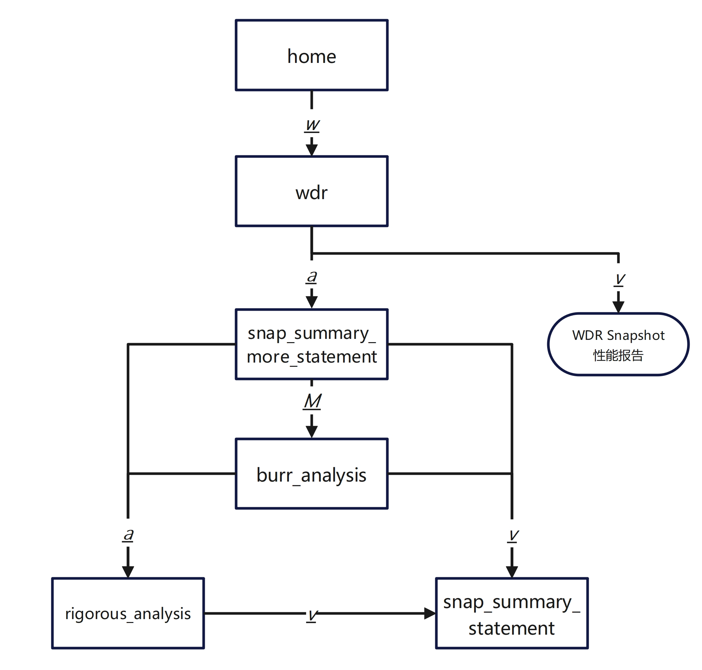

##### b. 页面

```
┌───────────────────────────────────────────────────────────────────────────────────────────────────────────────────────────────────────────────────────────────────────────────────────────────┐
│snapshot_id                                                     start_ts                                                        end_ts                                                         │
│_______________________________________________________________________________________________________________________________________________________________________________________________│
│1                                                               2024-06-04 11:10:00.246068+08:00                                2024-06-04 11:10:07.934061+08:00                               │
│2                                                               2024-06-04 11:12:57.728870+08:00                                2024-06-04 11:13:03.002992+08:00                               │
│3                                                               2024-06-04 11:20:00.408433+08:00                                2024-06-04 11:20:06.465137+08:00                               │
│4                                                               2024-06-04 11:30:01.051580+08:00                                2024-06-04 11:30:08.180709+08:00                               │
│5                                                               2024-06-04 11:40:01.775152+08:00                                2024-06-04 11:40:07.720832+08:00                               │
│6                                                               2024-06-04 11:50:02.307094+08:00                                2024-06-04 11:50:08.199315+08:00                               │
│7                                                               2024-06-04 12:00:02.783029+08:00                                2024-06-04 12:00:08.824063+08:00                               │
│8                                                               2024-06-04 12:10:03.411996+08:00                                2024-06-04 12:10:08.792858+08:00                               │
│9                                                               2024-06-04 12:20:04.373238+08:00                                2024-06-04 12:20:09.665000+08:00                               │
│10                                                              2024-06-04 12:30:05.260013+08:00                                2024-06-04 12:30:10.577898+08:00                               │
│11                                                              2024-06-04 12:40:06.145716+08:00                                2024-06-04 12:40:11.366058+08:00                               │
│12                                                              2024-06-04 12:50:06.970044+08:00                                2024-06-04 12:50:11.948799+08:00                               │
│13                                                              2024-06-04 13:00:07.546466+08:00                                2024-06-04 13:00:12.467045+08:00                               │
│14                                                              2024-06-04 13:10:08.044077+08:00                                2024-06-04 13:10:13.049415+08:00                               │
│15                                                              2024-06-04 13:20:08.647796+08:00                                2024-06-04 13:20:13.926610+08:00                               │
│16                                                              2024-06-04 13:30:09.523626+08:00                                2024-06-04 13:30:14.642238+08:00                               │
│17                                                              2024-06-04 13:40:10.219563+08:00                                2024-06-04 13:40:15.183178+08:00                               │
│18                                                              2024-06-04 13:50:10.788950+08:00                                2024-06-04 13:50:15.829176+08:00                               │
│19                                                              2024-06-04 14:00:11.407346+08:00                                2024-06-04 14:00:16.600881+08:00                               │
│20                                                              2024-06-04 14:10:12.196522+08:00                                2024-06-04 14:10:17.510279+08:00                               │
│21                                                              2024-06-04 14:13:42.874850+08:00                                2024-06-04 14:13:48.365963+08:00                               │
│22                                                              2024-06-04 14:14:50.161727+08:00                                2024-06-04 14:14:55.614358+08:00                               │
│23                                                              2024-06-04 14:18:25.039358+08:00                                2024-06-04 14:18:31.113554+08:00                               │
│24                                                              2024-06-04 14:20:12.220497+08:00                                2024-06-04 14:20:17.319579+08:00                               │
│25                                                              2024-06-04 14:21:03.665702+08:00                                2024-06-04 14:21:09.159260+08:00                               │
│26                                                              2024-06-04 14:21:43.504740+08:00                                2024-06-04 14:21:48.767787+08:00                               │
│27                                                              2024-06-04 14:23:16.177336+08:00                                2024-06-04 14:23:21.460828+08:00                               │
│28                                                              2024-06-04 14:23:34.301654+08:00                                2024-06-04 14:23:39.376553+08:00                               │
│29                                                              2024-06-04 14:25:33.863093+08:00                                2024-06-04 14:25:39.110424+08:00                               │
└───────────────────────────────────────────────────────────────────────────────────────────────────────────────────────────────────────────────────────────────────────────────────────────────┘
```

**页面指标**：

| 指标                         | 描述                                                         |
| ---------------------------- | ------------------------------------------------------------ |
| snapshot_id                  | WDR快照序号                                                        |
| start_ts                     | WDR快照开始时间                                                  |
| end_ts                       | WDR快照结束时间                                           |

##### c. 快捷键

| 键位 | 功能       | 范围              | 说明                                              |
| ---- | ---------- | ----------------- | ------------------------------------------------- |
| a    | 查看两个快照间多次执行数据 | wdr页面支持 | 在悬浮窗内输入两个节点snapshot_id并用-连接 |
| v    | 生成一张由两个快照节点数据分析后的html文件  | wdr页面支持 | 在悬浮窗内输入两个节点snapshot_id并用-连接               |

生成WDR Snapshot性能分析报告：

```
│wdr page temporarily inaccessible：/app/ogtop/all/ogtop_WDR_ASH.html 
```

#### 2）snap_summary_more_statement 多次执行sql数据

登陆ogtop任意界面，按`w`键进入wdr模块后输入两个节点id后进入snap_summary_more_statement页面。该页面的数据来自数据库内的WDR工具中的表summary_statement。

##### a. 页面

```
┌───────────────────────────────────────────────────────────────────────────────────────────────────────────────────────────────────────────────────────────────────────────────────────────────┐
│snapshot_id             snap_user_name          snap_unique_sql_id      snap_node_name          snap_node_id            snap_user_id            snap_query              n_calls                │
│_______________________________________________________________________________________________________________________________________________________________________________________________│
│251                     mlausr                  2056732578              dn_6001                 0                       16406                   select                  138187                 │
│                                                                                                                                                target_ip,snaptime,user                        │
```

**页面指标**：

| 指标                         | 描述                                                         |
| ----------------------------          | ------------------------------------------------------------ |
| snapshot_id                           | WDR快照序号                                                        |
| snap_user_name                        | 用户名称                                                  |
| snap_unique_sql_id                    | 归一化的SQL ID                                           |
| snap_node_name                        | 数据库进程名称                                                        |
| snap_node_id                          | 节点的ID                                                  |
| snap_user_id                          | 用户OID                                           |
| snap_query                            | 归一化的SQL                                                        |
| n_calls                               | 调用次数                                                  |
| total_elapse_time                     | SQL在内核内的总运行时间                                           |
| n_returned_rows                       | SELECT返回的结果集行数                                                        |
| n_tuples_fetched                      | 随机扫描行                                                  |
| n_tuples_returned                     | 顺序扫描行                                           |
| n_tuples_inserted                     | 插入行                                                        |
| n_tuples_updated                      | 更新行                                                  |
| n_tuples_deleted                      | 删除行                                           |
| n_blocks_fetched                      | buffer的块访问次数                                                        |
| n_blocks_hit                          | uffer的块命中次数                                                  |
| n_soft_parse                          | 软解析次数                                           |
| n_hard_parse                          | 硬解析次数                                                        |
| db_time                               | 有效的DB时间花费，多线程将累加                                                  |
| cpu_time                              | CPU时间                                           |
| execution_time                        | 执行器内执行时间                                                        |
| parse_time                            | SQL解析时间                                                  |
| plan_time                             | SQL生成计划时间                                           |
| rewrite_time                          | SQL重写时间                                                        |
| pl_execution_time                     | plpgsql上的执行时间                                                  |
| pl_compilation_time                   | plpgsql上的编译时间                                           |
| snap_net_send_info_time               | 通过物理连接发送消息的网络状态的时间                                                        |
| snap_net_send_info_n_calls            | 通过物理连接发送消息的网络状态的次数                                                  |
| snap_net_send_info_size               | 通过物理连接发送消息的网络状态的吞吐量                                           |
| snap_net_recv_info_time               | 通过物理连接接收消息的网络状态的时间                                                       |
| snap_net_recv_info_n_calls            | 通过物理连接接收消息的网络状态的次数                                                  |
| snap_net_recv_info_size               | 通过物理连接接收消息的网络状态的吞吐量                                           |
| snap_net_stream_send_info_time        | 通过逻辑连接发送消息的网络状态的时间                                                          |
| snap_net_stream_send_info_n_calls     | 通过逻辑连接发送消息的网络状态的次数                                                  |
| snap_net_stream_send_info_size        | 通过逻辑连接发送消息的网络状态的吞吐量                                           |
| snap_net_stream_recv_info_time        | 通过逻辑连接接收消息的网络状态的时间                                                          |
| snap_net_stream_recv_info_info_n_call | 通过逻辑连接接收消息的网络状态的次数                                                  |
| snap_net_stream_recv_info_size        | 通过逻辑连接接收消息的网络状态的吞吐量                                           |
| snap_last_updated                     | 最后一次更新该语句的时间                                                  |
| sort_count                            | 排序执行的次数                                           |
| sort_time                             | 排序执行的时间                                                        |
| sort_mem_used                         | 排序过程中使用的work memory大小                                                  |
| sort_spill_count                      | 序过程中，若发生落盘，写文件的次数                                           |
| sort_spill_size                       | 排序过程中，若发生落盘，使用的文件大小                                                        |
| hash_count                            | hash执行的次数                                                  |
| hash_time                             | hash执行的时间                                           |
| hash_mem_used                         | hash过程中使用的work memory大小                                                        |
| hash_spill_count                      | hash过程中，若发生落盘，写文件的次数                                                  |
| hash_spill_size                       | hash过程中，若发生落盘，使用的文件大小                                           |

##### b. 快捷键

| 键位 | 功能       | 范围              | 说明                                              |
| ---- | ---------- | ----------------- | ------------------------------------------------- |
| a    | 精确分析 | wdr页面支持 | 在悬浮窗内输入snap_unique_sql_id |
| v    | 查看该快照下该条数据信息  | wdr页面支持 | 在悬浮窗内输入snapshot_id-snap_unique_sql_id               |
| M    | 毛刺分析  | wdr页面支持 | 在悬浮窗内输入两个节点snapshot_id并用-连接               |

#### 3）burr_analysis 毛刺分析

登陆ogtop任意界面，按`w`键进入wdr模块后输入两个节点id后进入snap_summary_more_statement再使用快捷键`M`进入burr_analysis页面。该页面的数据来自数据库内的WDR工具中的表summary_statement。


##### a. 页面

```
┌───────────────────────────────────────────────────────────────────────────────────────────────────────────────────────────────────────────────────────────────────────────────────────────────┐
│snapshot_id             snap_unique_sql_id      snap_user_name          avg_execution_time      std_avg_execution_time  readline                max_avg_execution_time  snap_query             │
│_______________________________________________________________________________________________________________________________________________________________________________________________│
│                                                                                                                                                                                               │

```

**页面指标**：

| 指标                         | 描述                                                         |
| ----------------------------          | ------------------------------------------------------------ |
| snapshot_id                           | WDR快照序号                                                        |
| snap_unique_sql_id                    | 归一化的SQL ID                                           |
| snap_user_name                        | 用户名称                                                  |
| avg_execution_time                        | 平均执行时间                                                        |
| std_avg_execution_time                          | 平均执行时间的绝对值                                                  |
| readline                          | 异常比例                                           |
| max_avg_execution_time                            | 最大执行时间                                                        |
| snap_query                               | 归一化的SQL                                                  |
##### b. 快捷键

| 键位 | 功能       | 范围              | 说明                                              |
| ---- | ---------- | ----------------- | ------------------------------------------------- |
| a    | 精确分析 | wdr页面支持 | 在悬浮窗内输入snap_unique_sql_id |
| v    | 查看该快照下该条数据信息  | wdr页面支持 | 在悬浮窗内输入snapshot_id-snap_unique_sql_id               |
| M    | 毛刺分析  | wdr页面支持 | 在悬浮窗内输入两个节点snapshot_id并用-连接               |

#### 4）rigorous_analysis 精确分析

登陆ogtop任意界面，按`w`键进入wdr模块后输入两个节点id后进入snap_summary_more_statement，再使用快捷键`M`进入burr_analysis，再使用快捷键`a`进入或则直接在snap_summary_more_statement页面也可进入rigorous_analysis页面。该页面的数据来自数据库内的WDR工具中的表summary_statement。

##### a. 页面

```
 │please input snap_unique_sql_id(end with enter):2056732578   

┌───────────────────────────────────────────────────────────────────────────────────────────────────────────────────────────────────────────────────────────────────────────────────────────────┐
│                                                                      snapshot_id: 252                                                                                                         │
│                                                                      snap_unique_sql_id: 2056732578                                                                                           │
│_______________________________________________________________________________________________________________________________________________________________________________________________│
│n_calls: 1                                                                                                                                                                                     │
│n_calls_rate: 0.14324864833145406                                                                                                                                                              │
│total_elapse_time: 6032                                                                                                                                                                        │
│total_elapse_time_rate: 0.14276813807547098                                                                                                                                                    │
│n_returned_rows: 0                                                                                                                                                                             │
│n_returned_rows_rate: 0.14433756729740646                                                                                                                                                      │
│n_tuples_fetched: 0                                                                                                                                                                            │
│n_tuples_fetched_rate: 0.13790155837166448                                                                                                                                                     │
│n_tuples_returned: 0                                                                                                                                                                           │
│n_tuples_returned_rate: 0.1378937430288971                                                                                                                                                     │
│n_blocks_fetched: 26                                                                                                                                                                           │
│n_blocks_fetched_rate: 0.1419809000927166                                                                                                                                                      │
│n_blocks_hit: 10                                                                                                                                                                               │
│n_blocks_hit_rate: 0.14203489735843725                                                                                                                                                         │
│n_hard_parse: 1                                                                                                                                                                                │
│n_hard_parse_rate: 0.14324864833145406                                                                                                                                                         │
│db_time: 6272                                                                                                                                                                                  │
│db_time_rate: 0.1427922401542613                                                                                                                                                               │
│cpu_time: 3656                                                                                                                                                                                 │
│cpu_time_rate: 0.1429290069752328                                                                                                                                                              │
│execution_time: 3083                                                                                                                                                                           │
│execution_time_rate: 0.14234642416647447                                                                                                                                                       │
│parse_time: 94                                                                                                                                                                                 │
│parse_time_rate: 0.1428247627648454                                                                                                                                                            │
│plan_time: 907                                                                                                                                                                                 │
│plan_time_rate: 0.14298691202480834                                                                                                                                                            │
│rewrite_time: 2                                                                                                                                                                                │
│rewrite_time_rate: 0.1431971181273662                                                                                                                                                          │
│snap_net_send_info_n_calls: 8                                                                                                                                                                  │
│snap_net_send_info_n_calls_rate: 0.1414863039683733                                                                                                                                            │
│snap_net_send_info_size: 3300                                                                                                                                                                  │
│snap_net_send_info_size_rate: 0.14296926243629124                                                                                                                                              │
│snap_net_recv_info_time: 1818110832                                                                                                                                                            │
│snap_net_recv_info_time_rate: 0.13262829822022348                                                                                                                                              │
│snap_net_recv_info_n_calls: 1                                                                                                                                                                  │
│snap_net_recv_info_n_calls_rate: 0.14324864833145406                                                                                                                                           │
│snap_net_recv_info_size: 972                                                                                                                                                                   │
│snap_net_recv_info_size_rate: 0.1432482969119725                                                                                                                                               │
└───────────────────────────────────────────────────────────────────────────────────────────────────────────────────────────────────────────────────────────────────────────────────────────────┘
```

**页面指标**：

由于是精确分析故出现的字段不固定部分字段可根据snap_summary_more_statement页面字段理解

##### b. 快捷键

| 键位 | 功能       | 范围              | 说明                                              |
| ---- | ---------- | ----------------- | ------------------------------------------------- |
| v    | 查看该快照下该条数据信息  | wdr页面支持 | 在悬浮窗内输入snapshot_id-snap_unique_sql_id               |

#### 5）snap_summary_statement 查看完整sql数据

登陆ogtop任意界面，按`w`键进入wdr模块后输入两个节点id后进入snap_summary_more_statement，可以在snap_summary_more_statement、burr_analysis、rigorous_analysis这三个页面使用快捷键`v`进入snap_summary_statement页面。


##### a. 页面

```
│please input snapshot_id-snap_unique_sql_id(end with enter): 


┌───────────────────────────────────────────────────────────────────────────────────────────────────────────────────────────────────────────────────────────────────────────────────────────────┐
│snapshot_id:251         snap_node_name:dn_6001  snap_node_id:0          snap_user_name:mlausr   snap_user_id:16406      snap_unique_sql_id:2056 snap_n_calls:139252     snap_min_elapse_time:72│
│                                                                                                                        732578                                          7                      │
│                                                                                                                                                                                               │
│snap_max_elapse_time:10 snap_total_elapse_time: snap_n_returned_rows:61 snap_n_tuples_fetched:4 snap_n_tuples_returned: snap_n_tuples_inserted: snap_n_tuples_updated:0 snap_n_tuples_deleted:0│
│9433                    502.4347                560                     54624                   227941                  0                                                                      │
│                                                                                                                                                                                               │
│snap_n_blocks_hit:31868 snap_n_soft_parse:0     snap_n_hard_parse:13925 snap_db_time:543.3945   snap_cpu_time:448.2458  snap_execution_time:142 snap_parse_time:24.7128 snap_plan_time:211.6785│
│85                                              2                                                                       .8785                                                                  │
│                                                                                                                                                                                               │
│snap_rewrite_time:0.797 snap_pl_execution_time: snap_pl_compilation_tim snap_data_io_time:71064 snap_net_send_info_time snap_net_send_info_n_ca snap_net_send_info_size snap_net_recv_info_time│
│9                       0.0                     e:0.0                   001                     :7.6669                 lls:0.2768              :292.0715               :6082072.0348          │
│                                                                                                                                                                                               │
│snap_net_recv_info_n_ca snap_net_recv_info_size snap_net_stream_send_in snap_net_stream_send_in snap_net_stream_send_in snap_net_stream_recv_in snap_net_stream_recv_in snap_net_stream_recv_in│
│lls:0.1393              :135.648                fo_time:0.0             fo_n_calls:0.0          fo_size:0.0             fo_time:0.0             fo_info_n_calls:0.0     fo_size:0.0            │
│                                                                                                                                                                                               │
│snap_last_updated:2024- snap_sort_count:0       snap_sort_time:0.0      snap_sort_mem_used:0    snap_sort_spill_count:0 snap_sort_spill_size:0  snap_hash_count:0       snap_hash_time:0.0     │
│04-11                                                                                                                                                                                          │
│03:11:29.816950+08:00                                                                                                                                                                          │
│                                                                                                                                                                                               │
│snap_hash_mem_used:0    snap_hash_spill_count:0 snap_hash_spill_size:0                                                                                                                         │
│_______________________________________________________________________________________________________________________________________________________________________________________________│
│snap_query: select target_ip,snaptime,user_name,unique_sql_id,query,n_calls,total_elapse_time,n_returned_rows,n_tuples_fetched,n_tuples_returned,n_tuples_inserted,n_tuples_updated,n_tuples_de│
│leted,n_blocks_fetched,n_blocks_hit,n_soft_parse,n_hard_parse,db_time,cpu_time,execution_time,parse_time,plan_time,rewrite_time,pl_execution_time,pl_compilation_time,data_io_time,net_send_inf│
│o_time,net_send_info_n_calls,net_send_info_size,net_recv_info_time,net_recv_info_n_calls,net_recv_info_size,net_stream_send_info_time,net_stream_send_info_n_calls,net_stream_send_info_size,ne│
│t_stream_recv_info_time,net_stream_recv_info_n_calls,net_stream_recv_info_size,sort_count,sort_time,sort_mem_used,sort_spill_count,sort_spill_size,hash_count,hash_time,hash_mem_used,hash_spil│
│l_count,hash_spill_size from OG_STATEMENT_ORIGINAL_DATA                                                                                                                                        │
│        where target_ip= ? and user_name= ? and unique_sql_id= ?                                                                                                                               │
│        order by snaptime                                                                                                                                                                      │
│        desc fetch first ? rows only                                                                                                                                                           │
│                                                                                                                                                                                               │
│                                                                                                                                                                                               │
└───────────────────────────────────────────────────────────────────────────────────────────────────────────────────────────────────────────────────────────────────────────────────────────────┘
```

**页面指标**：


| 指标                         | 描述                                                         |
| ----------------------------          | ------------------------------------------------------------ |
| snapshot_id                           | WDR快照序号                                                        |
| snap_node_name                        | 数据库进程名称                                                        |
| snap_node_id                          | 节点的ID                                                  |
| snap_user_name                        | 用户名称                                                  |
| snap_user_id                          | 用户OID                                           |
| snap_unique_sql_id                    | 归一化的SQL ID                                           |
| snap_n_calls                          | 调用次数                                                  |
| snap_min_elapse_time                  | 调用次数                                                  |
| snap_max_elapse_time                  | 调用次数                                                  |
| snap_total_elapse_time                | SQL在内核内的总运行时间                                           |
| snap_n_returned_rows                  | SELECT返回的结果集行数                                                        |
| snap_n_tuples_fetched                 | 随机扫描行                                                  |
| snap_n_tuples_returned                | 顺序扫描行                                           |
| snap_n_tuples_inserted                | 插入行                                                        |
| snap_n_tuples_updated                 | 更新行                                                  |
| snap_n_tuples_deleted                 | 删除行                                           |
| snap_n_blocks_fetched                 | buffer的块访问次数                                                        |
| snap_n_blocks_hit                     | uffer的块命中次数                                                  |
| snap_n_soft_parse                     | 软解析次数                                           |
| snap_n_hard_parse                     | 硬解析次数                                                        |
| snap_db_time                          | 有效的DB时间花费，多线程将累加                                                  |
| snap_cpu_time                         | CPU时间                                           |
| snap_execution_time                   | 执行器内执行时间                                                        |
| snap_parse_time                       | SQL解析时间                                                  |
| snap_plan_time                        | SQL生成计划时间                                           |
| snap_rewrite_time                     | SQL重写时间                                                        |
| snap_pl_execution_time                | plpgsql上的执行时间                                                  |
| snap_pl_compilation_time              | plpgsql上的编译时间                                           |
| snap_data_io_time                     | io上的时间花费                                           |
| snap_net_send_info_time               | 通过物理连接发送消息的网络状态的时间                                                        |
| snap_net_send_info_n_calls            | 通过物理连接发送消息的网络状态的次数                                                  |
| snap_net_send_info_size               | 通过物理连接发送消息的网络状态的吞吐量                                           |
| snap_net_recv_info_time               | 通过物理连接接收消息的网络状态的时间                                                       |
| snap_net_recv_info_n_calls            | 通过物理连接接收消息的网络状态的次数                                                  |
| snap_net_recv_info_size               | 通过物理连接接收消息的网络状态的吞吐量                                           |
| snap_net_stream_send_info_time        | 通过逻辑连接发送消息的网络状态的时间                                                          |
| snap_net_stream_send_info_n_calls     | 通过逻辑连接发送消息的网络状态的次数                                                  |
| snap_net_stream_send_info_size        | 通过逻辑连接发送消息的网络状态的吞吐量                                           |
| snap_net_stream_recv_info_time        | 通过逻辑连接接收消息的网络状态的时间                                                          |
| snap_net_stream_recv_info_info_n_call | 通过逻辑连接接收消息的网络状态的次数                                                  |
| snap_net_stream_recv_info_size        | 通过逻辑连接接收消息的网络状态的吞吐量                                           |
| snap_last_updated                     | 最后一次更新该语句的时间                                                  |
| snap_sort_count                       | 排序执行的次数                                           |
| snap_sort_time                        | 排序执行的时间                                                        |
| snap_sort_mem_used                    | 排序过程中使用的work memory大小                                                  |
| snap_sort_spill_count                 | 序过程中，若发生落盘，写文件的次数                                           |
| snap_sort_spill_size                  | 排序过程中，若发生落盘，使用的文件大小                                                        |
| snap_hash_count                       | hash执行的次数                                                  |
| snap_hash_time                        | hash执行的时间                                           |
| snap_hash_mem_used                    | hash过程中使用的work memory大小                                                        |
| snap_hash_spill_count                 | hash过程中，若发生落盘，写文件的次数                                                  |
| snap_hash_spill_size                  | hash过程中，若发生落盘，使用的文件大小                                           |
| snap_query                            | 归一化的SQL                                                        |

### 20、快捷键弹窗

**全局功能快捷键**

| 键位  | 功能     | 范围              | 说明                                                         |
| ----- | -------- | ----------------- | ------------------------------------------------------------ |
| Esc   | 重置按钮 | ogtop全页面支持   | 使用页面小功能时或使用后，回到原始界面时使用                 |
| F     | 冻结屏幕 | ogtop全页面支持   | 在需要查看固定一组数据是使用                                 |
| Left  | 左翻页   | ogtop部分页面支持 | 页面需要展示数据太多，根据序号进行分页，使用左右键查看其余部分 |
| Right | 右翻页   | ogtop部分页面支持 | 页面需要展示数据太多，根据序号进行分页，使用左右键查看其余部分 |
| Up    | 上翻     | ogtop部分页面支持 | 多行数据页面展示不完整，利用上下键翻看                       |
| Down  | 下翻     | ogtop部分页面支持 | 多行数据页面展示不完整，利用上下键翻看                       |
| h     | help     | ogtop全页面支持   | 显示帮助                                                     |
| q     | 退出     | ogtop全页面支持   | 退出ogtop工具                                                |
| p     | 快照     | ogtop全页面支持   | 保存页面此刻展示数据                                         |

#### 1）/ - 筛选弹窗

具备关键字搜索功能，例如输入/进入搜索模式，输入关键字后可以过滤掉与关键字不匹配的项。

以session主页面为例，支持根据pid、current_state、db_name、user_name、application_name、client_addr、waiting、wait_status 字段进行查询

搜索active状态的session：

```
┌─────────────────────────────────────────────────────┐
│please enter what to find(end with enter):           │

显示结果：
│pid                        query                     current_state              xact_start_time(ms)       query_start_time(ms)       waiting                   wait_status                wait_event               │
│___________________________________________________________________________________________________________________________________________________________________________________________________________________│
│139748102174464            select * from             active                     100.608                   100.609                    False                     wait cmd                   wait cmd                 │
│                           JMX_KAFKA_PERFORMANCE                                                                                                                                                                   │
│                           where host= '197.0.192.4                                                                                                                                                                │
│139727581914880            select ACTIVITY.datid,    active                     123.682                   123.09                     False                     HashJoin - build hash      HashJoin - build hash    │
│                                  ACTIVITY.datname,                                                                                                                                                                │
│                                  ACTIV                                                                                                                                                                            │
│139747385526016               INSERT INTO OG_STATEME active                     103.412                   103.413                    False                     none                       none                     │
│                           NT_ORIGINAL_DATA                                                                                                                                                                        │
│                           (target_ip, snapti                                                                                                                                                                      │
│139734476445440               INSERT INTO            active                     106.734                   106.735                    False                     wait io                    DataFileRead             │
│                           OG_CONF_USER_TABLES_DATA                                                                                                                                                                │
│                           (target_ip, datname,                                                                                                                                                                    │

支持再次进行匹配：
│pid                        query                     current_state              xact_start_time(ms)       query_start_time(ms)       waiting                   wait_status                wait_event               │
│___________________________________________________________________________________________________________________________________________________________________________________________________________________│
│139727581914880            select ACTIVITY.datid,    active                     499.567                   498.973                    False                     HashJoin - build hash      HashJoin - build hash    │
│                                  ACTIVITY.datname,                                                                                                                                                                │
│                                  ACTIV                                                                                                                                                                            │
```

#### 2）z - 排序弹窗

具备根据任意选定列的值进行排序的功能。例如：按入`z`进入选择模式，⬆⬇⬅➡键选中要排序的字段，点击 回车，按照选中列进行排序。

第n次：

- 奇数：倒序
- 偶数：正序

以session主页面为例，

```
┌──────────────────────────────────────────────────────────────────────────────────────────────────────────────────────────────┐ 
│             < pid                           > < query                         > < current_state                >             │
│             < xact_start_time               > < query_start_time              > < waiting                      >             │
│             < wait_status                   > < wait_event                    > < db_time                      >             │ 
│             < cpu_time                      > < execute_time                  > < data_io_time                 >             │
│             < db_name                       > < user_name                     > < application_name             >             │
│             < client_addr                   >                                                                                │
└──────────────────────────────────────────────────────────────────────────────────────────────────────────────────────────────┘
```

第一次选中为倒序：

```
│pid                        query                     current_state              xact_start_time(ms)       query_start_time(ms)       waiting                   wait_status                wait_event               │
│___________________________________________________________________________________________________________________________________________________________________________________________________________________│
│139752279897856            insert into               idle                       0                         0.0                        False                     wait cmd                   wait cmd                 │
│                           DB2_DBSNAP_DELTA                                                                                                                                                                        │
│                           (ACTIVE_HASH_JOINS,                                                                                                                                                                     │
│                           ACTIVE_OLA                                                                                                                                                                              │
│139752068085504            select * from             idle                       0                         0.0                        False                     wait cmd                   wait cmd                 │
│                           JMX_KAFKA_PERFORMANCE                                                                                                                                                                   │
│                           where host= '197.20.39.1                                                                                                                                                                │
│139751940683520            select redis_db,redis_db_ idle                       0                         0.0                        False                     wait cmd                   wait cmd                 │
│                           dealdata from                                                                                                                                                                           │
│                           database_type_manage                                                                                                                                                                    │
│139751903786752            merge into MLAUSR.JMX_KAF idle                       0                         0.0                        False                     wait cmd                   wait cmd                 │
│                           KA_CONSUME_PERFORMANCE_SU                                                                                                                                                               │
│                           MMARY as P                                                                                                                                                                              │
│139751870428928            insert into MYSQL_EVENTSN idle                       0                         0.0                        False                     wait cmd                   wait cmd                 │
│                           AP_ORIGINAL_DATA                                                                                                                                                                        │
│                           (DBID,METRIC_NAME,                                                                                                                                                                      │
```

第二次选中为正序：

```
│___________________________________________________________________________________________________________________________________________________________________________________________________________________│
│pid                        query                     current_state              xact_start_time(ms)       query_start_time(ms)       waiting                   wait_status                wait_event               │
│___________________________________________________________________________________________________________________________________________________________________________________________________________________│
│139714255460096            MERGE INTO MLAUSR.celery_ idle                       0                         0.0                        False                     wait cmd                   wait cmd                 │
│                           task_monitor P1                                                                                                                                                                         │
│                           USING (SELECT *                                                                                                                                                                         │
│                                                                                                                                                                                                                   │
│139714289022720            SELECT * FROM             idle                       0                         0.0                        False                     wait cmd                   wait cmd                 │
│                           CELERY_MONITOR WHERE                                                                                                                                                                    │
│                           NAME='mlagausskafkadealda                                                                                                                                                               │
│139714305804032            select * from             idle                       0                         0.0                        False                     wait cmd                   wait cmd                 │
│                           database_type_manage                                                                                                                                                                    │
│                           where kafka_topic is not                                                                                                                                                                │
```


