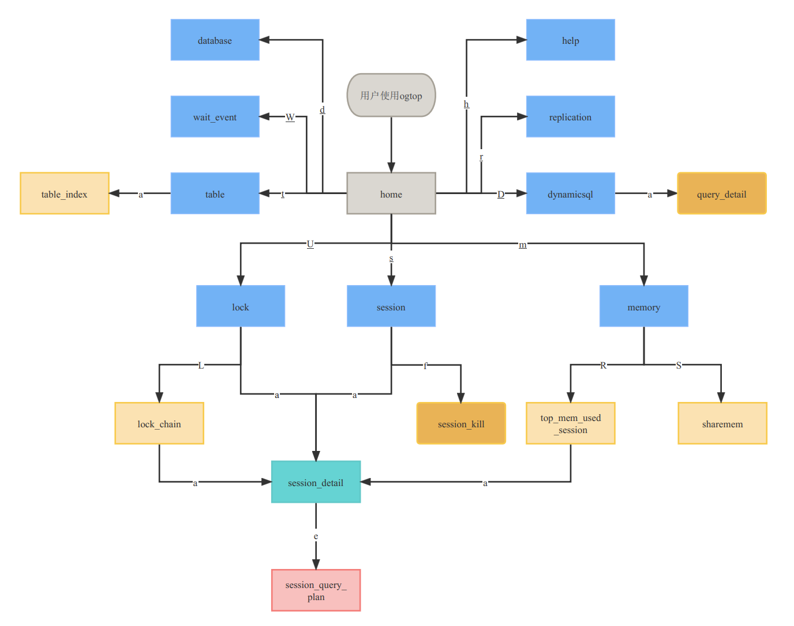

# ogtop

## 一、简介

ogtop是一款用于监控opengauss数据库实时容量、性能、运行状态等关键信息的命令行工具。ogtop的主要开发语言为python，通过opengauss原生接口psycopg2连接数据库，从数据库系统表中获取监控数据，经由numpy清洗数据后通过pandas进行实时数据的计算，最后通过urwid进行页面展示。本工具从各个角度提供了详细的opengauss实时运行数据，并且具备常用的数据筛选功能，为DBA检查数据库运行情况提供了一条简单易用的途径。 

### 1、特性

- 自带依赖包，解压即用，部署简易。

- 支持本地解压即运行的模式，不必担心网络不通、网络延迟等问题。

- 使用简单、信息展现直观，可以帮助DBA低成本获取数据库即时运行信息。

- 基于python开发，具备较好的可扩展性。

### 2、功能介绍

- ogtop共有8个一级页面，分别从不同角度展示数据库当前运行情况。每个页面中包含各自相关的详细信息页，可以通过输入特定的字段（如会话的pid或者表名称）来进入特定对象的详细信息展示页。
- ogtop拥有丰富的查阅辅助功能，可以在页面中根据指定的指标排序、根据输入的关键字进行数据过滤等。
- ogtop可以随时截取当前时间的数据快照、并可以在部分页面中快捷终止指定范围的（可根据pid、库名、是否空闲等条件）数据库会话。

**一级页面**：

- **Database**：数据库总览页，监控数据全局指标
- **Session**：数据库会话页，监控数据库会话
- **Table**：展示数据表信息
- **Memory**：展示内存信息
- **Dynaticsql**：展示动态sql相关信息
- **LOCKS**：展示锁信息
- **wait_event**：展示数据库等待事件相关信息
- **replicaiton**：展示复制状态信息

**功能按键**

| 键位  | 功能     | 范围              | 说明                                                         |
| ----- | -------- | ----------------- | ------------------------------------------------------------ |
| Esc   | 重置按钮 | OGtop全页面支持   | 使用页面小功能时或使用后，回到原始界面时使用                 |
| F     | 冻结屏幕 | OGtop全页面支持   | 在需要查看固定一组数据是使用                                 |
| Left  | 左翻页   | OGtop部分页面支持 | 页面需要展示数据太多，根据序号进行分页，使用左右键查看其余部分 |
| Right | 右翻页   | OGtop部分页面支持 | 页面需要展示数据太多，根据序号进行分页，使用左右键查看其余部分 |
| Up    | 上翻     | OGtop部分页面支持 | 上下键翻页                                                   |
| Down  | 下翻     | OGtop部分页面支持 | 上下键翻页                                                   |
| h     | help     | OGtop全页面支持   | 显示帮助                                                     |
| q     | 退出     | OGtop全页面支持   | 退出OGtop工具                                                |
| p     | 快照     | OGtop全页面支持   | 截取页面数据快照                                             |
| f     | 杀会话   | OGtop部分页面支持 | 根据选择的条件终止指定范围的会话                             |
| a     | 详细页面 | OGtop部分页面支持 | 根据数据的字段进度特定对象的详细信息展示页                   |
| /     | 过滤     | OGtop部分页面支持 | 根据选择的条件过滤无关信息条目                               |
| z     | 扩展排序 | OGtop部分页面支持 | 选定需要排序的字段，按照倒序排序，连续选中两次即为正序       |

**Ogtop工具地图**


<<<<<<< HEAD

### **3、介质说明**

ogtop_x86.tar.gz：X86版本安装包

ogtop_x86.tar.gz：arm版本安装包

ogtop文件夹：ogtop源码

Readme：说明文档
=======
>>>>>>> c813002 (Ogtop_V1.0)

## 二、安装

1. 下载安装包

   - arm系统：使用ogtop-Arm版本包
   - X86系统：使用ogtop-x86版本包

2. 解压

   ```
   tar -xf ogtop_arm.tar.gz
   tar -xf ogtop_x86.tar.gz
   ```

3. 创建ogtop专用数据库用户（示例中创建了测试用的数据库，实际使用中可以不创建，但是需要对数据库用户授权。）
   实际使用中也可以直接使用omm用户或其他已有用户（需确保权限足够）。

   ```
   create database ogtop ;
   \c ogtop 
   create user ogtop sysadmin password 'Ogtop@123';
   alter database ogtop owner to ogtop ;
   grant USAGE on SCHEMA dbe_perf to ogtop ;
   ```

   > 注意：连接数据库的用户必须有dbe_perf schema的USUAGE权限。


## 三、使用

**免密运行ogtop**：

   ```
   需要使用数据库服务器本地omm用户
   ./ogtop  database user 
   例：
   ./ogtop postgres omm
   ```

**输入数据库用户密码运行ogtop**：

   ```
   ./ogtop ip port database user 
   例：
   ./ogtop 197.0.194.195 26000 ogtop ogtop
   根据提示数据指定用户的用户密码即可。（需要确保指定的用户具有第二章节中提到的数据库权限）
   ```


### 1、首页

home页面是整个ogtop监控工具的默认主页与导航入口。

用户使用ogtop数据库监控工具连接数据库，进入首页home页面，可以根据页面提示进入对应的功能模块查看对应的数据。

用户在任意页面都可以通过页面快捷键来切换到不同的页面。

每个页面都有不同的辅助功能快捷键，可以在不同页面通过按h进入help页面查看。

> Tips：单页展示不下的行或者列，可以通过上下左右键进行翻页

#### 1）流程图


#### 2）页面


#### 3）页面快捷键

| 键位 | 功能        | 范围            | 说明                        |
| ---- | ----------- | --------------- | --------------------------- |
| d    | database    | OGtop全页面支持 | database数据概览页面        |
| s    | session     | OGtop全页面支持 | session会话连接数据概览页面 |
| t    | table       | OGtop全页面支持 | table表数据概览页面         |
| m    | memory      | OGtop全页面支持 | memory内存数据概览页面      |
| D    | dynamicsql  | OGtop全页面支持 | dynamicsql数据概览页面      |
| U    | lock        | OGtop全页面支持 | lock锁数据概览页面          |
| W    | wait_event  | OGtop全页面支持 | wait_event数据概览页面      |
| r    | replication | OGtop全页面支持 | 流复制数据概览页面          |
| h    | help        | OGtop全页面支持 | help帮助概览页面            |


### 2、帮助页

进入ogtop任意界面，按`h`键，可进入帮助页面，在这里可以查看不同页面可进行操作的所有按键及其功能。


**页面快捷键**

| 指标           | 描述                         |
| -------------- | ---------------------------- |
| Local Time     | 当前服务器时间               |
| Query interval | 查询间隔（每2s刷新一次数据） |
| Port           | 数据库端口                   |
| dbname         | 连接的数据库名               |
| Hostname       | 当前服务器hostname           |
| ogtop          | ogtop的版本                  |
| page           | 页码                         |

**功能快捷键**

| 键位  | 功能     | 范围              | 说明                                                           |
| ----- | -------- | ----------------- | ---------------------------------------------------------------|
| Esc   | 重置按钮 | OGtop全页面支持   | 使用页面小功能时或使用后，回到原始界面时使用                   |
| F     | 冻结屏幕 | OGtop全页面支持   | 在需要查看固定一组数据是使用                                   |
| Left  | 左翻页   | OGtop部分页面支持 | 页面需要展示数据太多，根据序号进行分页，使用左右键查看其余部分 |
| Right | 右翻页   | OGtop部分页面支持 | 页面需要展示数据太多，根据序号进行分页，使用左右键查看其余部分 |
| Up    | 上翻     | OGtop部分页面支持 | 多行数据页面展示不完整，利用上下键翻看                         |
| Down  | 下翻     | OGtop部分页面支持 | 多行数据页面展示不完整，利用上下键翻看                         |
| h     | help     | OGtop全页面支持   | 显示帮助                                                       |
| q     | 退出     | OGtop全页面支持   | 退出OGtop工具                                                  |
| p     | 快照     | OGtop全页面支持   | 保存页面此刻展示数据                                           |
| f     | 杀会话   | OGtop部分页面支持 | 根据选择的条件终止指定范围的会话                               |
| a     | 详细页面 | OGtop部分页面支持 | 根据数据的字段进度特定对象的详细信息展示页                     |
| /     | 过滤     | OGtop部分页面支持 | 根据选择的条件过滤无关信息条目                                 |
| z     | 扩展排序 | OGtop部分页面支持 | 选定需要排序的字段，按照倒序排序，连续选中两次即为正序         |


### 3、database - 全局总览页

该模块显示数据库的各项状态指标总览。进入ogtop的任意界面后按`d`即可进入database指标查看页面。

#### 	a. 流程图


#### 	b. 页面

database页面提供数据库的总体概览信息，包括当前的活跃会话比例，当前节点的状态以及角色，内存参数的值等


| 指标                                   | 描述                                         |
| -------------------------------------- | -------------------------------------------- |
| active session/session                 | 活动会话数占总会话数的比例                   |
| blks_hit/(blks_hit+read)               | 查询命中率                                   |
| select_count/dml_count                 | select在所有dml中的占比                      |
| DATA_IO_TIME/DB_TIME                   | 数据io时间在数据库时间的占比                 |
| dynamic_used_memory/max_dynamic_memory | 动态内存使用率                               |
| start_date                             | 数据库启动日期                               |
| start_time                             | 数据库启动时间                               |
| wal_status                             | 主从(集群)状态                               |
| LocalRole                              | 本地角色                                     |
| ProcesMem                              | 已使用的进程内存                             |
| Dynamic_Mem                            | 已使用的动态内存                             |
| Shared_Mem                             | 已使用的共享内存                             |
| Session                                | 会话数                                       |
| Actsess                                | 正在运行的会话数                             |
| Waiting                                | 等待锁的会话数                               |
| idleintran                             | idle in transaction 状态的session会话数      |
| xact_commit                            | 事务提交数                                   |
| xact_rollback                          | 事务回滚数                                   |
| totalcount                             | totalcount=ddl_count+dml_count+dcl_count     |
| ddl_count                              | ddl数量                                      |
| dml_count                              | dml数量                                      |
| dcl_count                              | dcl数量                                      |
| select_count                           | select数量                                   |
| update_count                           | update数量                                   |
| insert_count                           | insert数量                                   |
| delete_count                           | delete数量                                   |
| num_cpus                               | CPU 数量                                     |
| num_cpu_cores                          | CPU 核数                                     |
| num_cpu_sockets                        | CPU sockets数                                |
| blks_read                              | 读取块数                                     |
| blks_hit                               | 命中块数                                     |
| hitratio                               | 命中率                                       |
| tup_fetched                            | fetch行数                                    |
| tup_inserted                           | insert行数                                   |
| tup_update                             | update行数                                   |
| tup_delete                             | delete行数                                   |
| DB_TIME/ms                             | 数据库时间                                   |
| cpu_time                               | cpu时间                                      |
| execute_time                           | sql执行时间                                  |
| data_io_time                           | 数据io时间                                   |
| blk_read_time                          | 块读取时间                                   |
| blk_write_time                         | 块写入时间                                   |
| redo_writetim                          | redo日志写时间                               |
| temp_files                             | 临时文件数                                   |
| temp_bytes                             | 临时文件大小                                 |
| conflicts                              | 数据库冲突数                                 |
| deadlocks                              | 死锁数量                                     |
| checkpoints                            | checkpoints数量                              |
| pgwrits                                | pg写入数                                     |
| double_writes                          | 双写次数                                     |
| physical_memory_bytes                  | 物理内存大小                                 |
| idle_time                              | 处理器空间时间                               |
| busy_time                              | 处理器繁忙时间                               |
| user_time                              | 用户态的时间                                 |
| sys_time                               | 内核态时间                                   |
| iowait_time                            | iowait时间                                   |
| nice_time                              | Cpu调度优先级花费的时间                      |
| vm_page_in_bytes                       | 虚拟内存中 从Swap区读入的字节数              |
| vm_page_out_bytes                      | 虚拟内存中 从Swap区读出的字节数              |
| os_load_processes                      | 负载                                         |
| db_time                                | 数据库时间                                   |

### 4、session - 会话

该模块显示session数据库会话连接的各项状态指标。进入ogtop任意界面后按`s`进入查看该模块的功能。

按照如下步骤创建测试表和对应的测试数据：


#### 1）session 页面

##### 		a. 流程图


##### 		b. 页面

进入Home页面，按`s`进入session主页面。

该页面提供查询数据库所有session连接的大致情况


| 指标                      | 描述                                                         |
| ------------------------- | ------------------------------------------------------------ |
| active session/session    | 活动会话占总会话数的比例                                     |
| n_commit                  | 数据库实时提交总数                                           |
| n_rollback                | 数据库实时回滚总数                                           |
| n_sql                     | 数据库实时sql总数                                            |
| n_table_scan              | 数据库实时表扫描总数                                         |
| n_shared_blocks_read      | 数据库实时共享块读取总数                                     |
| n_sort_in_memory          | 数据库实时内存排序总数                                       |
| n_local_blocks_read       | 数据库实时本地块读取总数                                     |
| n_sort_in_disk            | 数据库实时磁盘排序总数                                       |
| n_cu_hdd_asyn_read        | 数据库实时磁盘异步读取cu总数                                 |
| n_blocks_read_time        | 数据库实时块读取总时间                                       |
| n_cu_mem_hit              | 数据库实时CU内存命中总次数                                   |
| n_blocks_fetched          | 数据库实时块fetch总数                                        |
| n_physical_read_operation | 数据库实时物理读操作总数                                     |
| n_shared_blocks_dirtied   | 数据库实时脏共享块总数                                       |
| n_local_blocks_dirtied    | 数据库实时脏本地块总数                                       |
| n_blocks_write_time       | 数据库实时块写入总时间                                       |
| n_cu_hdd_sync_read        | 数据库实时磁盘同步读取cu总数                                 |
| pid                       | 后台线程ID                                                   |
| current_state             | 该后台当前总体状态                                           |
| db_name                   | 数据库名                                                     |
| user_name                 | 会话发起的用户名                                             |
| application_name          | 应用程序名                                                   |
| client_addr               | 客户端地址                                                   |
| xact_start_time           | 启动当前事务的时间                                           |
| state_change_time         | 上次状态改变的时间                                           |
| waiting                   | 如果后台当前正等待锁则为true                                 |
| wait_status               | 当前线程的等待状态                                           |
| wait_event                | 如果wait_status是acquire lock、acquire lwlock、wait io三种类型，此列描述具体的锁、轻量级锁、IO的信息。否则是空。 |
| db_time/s                 | 有效执行时间                                                 |
| cpu_time/s                | cpu时间花销                                                  |
| excute_time/s             | 执行器内时间花销                                             |
| data_io_time              | IO时间花销                                                   |
| query                     | 查询的sql语句                                                |

##### 		c. 快捷键

| 键位 | 功能                     | 范围            | 说明                                                         |
| ---- | ------------------------ | --------------- | ------------------------------------------------------------ |
| a    | 前往session_detail页面   | session页面支持 | 复制需要查询的session的pid，输入到提示框内                   |
| /    | 根据条件过滤             | session页面支持 | 复制需要查询的内容，输入到提示框内                           |
| z    | 根据选定列扩展排序       | session页面支持 | 在悬浮窗内选定需要排序的字段后，按照倒序排序，连续选中两次即为正序 |
| f    | 根据单选按钮kill session | session页面支持 | Kill session时为四种模式，force_all、force_by_dbname、force_idle、force_by_pid，按需谨慎选择 |

#### 2）session_detail 页面

```
session >> session_detail
```

##### 	a. 页面

进入session 主页面，按`a`键，弹出如下输入框，输入要查询session的pid，以`enter`结尾，进入详细信息页面：


成功进入 pid=281435681094832 的session详情页面,此页面针对特定session展示更为详细的指标信息：


| 指标                  | 描述                                                         |
| --------------------- | ------------------------------------------------------------ |
| query_id              | 查询语句 的id                                                |
| state_sum             | 总状态数                                                     |
| backend_start         | 开始当前活跃查询的时间（如果state的值不是active，则这个值是上一个查询的开始时间） |
| query_start           | 该过程开始的时间，即当客户端连接服务器时间                   |
| datid                 | 数据库ID                                                     |
| datname               | 数据库名                                                     |
| usesysid              | 登陆该后台的用户OID                                          |
| usename               | 登陆该后台的用户名                                           |
| application_name      | 应用程序名                                                   |
| client_addr           | 客户端地址                                                   |
| client_hostname       | 客户端主机名                                                 |
| client_port           | 客户端端口                                                   |
| xact_start_time       | 启动当前事务的时间                                           |
| state_change_time     | 上次状态改变的时间                                           |
| waiting               | 如果后台当前正等待锁则为true                                 |
| total_cpu_time/s      | 语句在数据库节点上的CPU总时间                                |
| db_time/s             | 有效执行时间                                                 |
| cpu_time/s            | cpu时间花销                                                  |
| excute_time/s         | 执行器内时间花销                                             |
| data_io_time/s        | IO时间花销                                                   |
| parse_time/s          | Sql解析时间花销                                              |
| plan_time/s           | 生成plan的时间花销                                           |
| rewrite_time/s        | sql重写的时间花销                                            |
| net_send_time/s       | 网络上的时间花销                                             |
| init_mem              | 当前正在执行作业进入执行器前已分配的内存                     |
| used_mem              | 当前正在执行作业已分配的内存                                 |
| peak_mem              | 当前正在执行作业已分配的内存峰值                             |
| wait_status           | 当前线程的等待状态                                           |
| locktag               | 当前线程正在等待锁的信息。                                   |
| lockmode              | 当前线程正等待获取的锁模式。包含表级锁、行级锁、页级锁下的各模式。 |
| block_sessionid       | 阻塞当前线程获取锁的会话标识。                               |
| pl_execution_time/s   | plpgsql（存储过程）执行的时间花销                            |
| pl_compilation_time/s | plpgsql（存储过程）编译的时间花销                            |
| query                 | 查询语句内容                                                 |

##### 	b. 快捷键 

| 键位 | 功能                       | 范围                   | 说明                                 |
| ---- | -------------------------- | ---------------------- | ------------------------------------ |
| f    | Kill session               | session_detail页面支持 | 使用功能时需在复检页面在进行二次确认 |
| e    | 前往session_query_plan页面 | session_detail页面支持 | 页面所示内容为session_query_plan     |

**f - kill session**：

在会话详细信息页按`f`，提示是否终止会话，输入y确认杀死该session；否则输入 n

杀死当前session：


session 已经被杀掉：

```
ogtop=> end;
FATAL:  terminating connection due to administrator command
could not send data to server: Broken pipe
The connection to the server was lost. Attempting reset: Failed.
```

#### 3）session_query_plan

该页面分为两部分：

- **advise**：索引推荐。指定session的查询语句生成推荐的索引
- **explain**：显示该条语句的执行计划

```
session >> session_detail >> session_query_plan
```


提供可以通过键`b`，返回到session_detail界面

#### 4）session_kill

```
session >> session_kill
```

进入session主页面，按`f`键，弹出session_kill的窗口，有下图所示的四种模式：

- **force_all**：kill非omm用户的所有后台线程
- **force_by_dbname**：kill连接指定数据库的所有session
- **force_idle**：kill 状态为 idle in transaction且持续时间超过10min的session
- **force_by_pid**：指定 pid 进行kill

> 原理：使用pg_terminate_backend()函数完成kill操作


#### 注意事项

1.暂时后台获取数据时较慢，在使用其他小功能时，摁完快捷键后需等待2s左右，等待页面刷新结束

2.在使用kill session功能时，请谨慎选择，避免产生无法预估事件

### 5、Table - 表

登陆ogtop任意界面，按`t`键进入table模块，查看数据库中表数据的概览情况

#### 1）Table 主页面

##### 	a. 流程图


##### 		b. 页面

该页面的指标大部分来自`pg_stat_user_tables`系统视图，显示表的状态信息


| 指标              | 描述                                                         |
| ----------------- | ------------------------------------------------------------ |
| Rows r+w/s        | 每秒读行数+每秒写行数                                        |
| relname           | 表名                                                         |
| schemaname        | schema名                                                     |
| datname           | 数据库名                                                     |
| idx_blks_hit      | 从表中所有索引命中的磁盘块数                                 |
| idx_blks_read     | 从表中所有索引读取的磁盘块数                                 |
| toast_blks_read   | 该表的TOAST表读取的磁盘块数（如果存在）。                    |
| toast_blks_hit    | 该表的TOAST表命中缓冲区数（如果存在）。                      |
| tidx_blks_read    | 该表的TOAST表索引读取的磁盘块数（如果存在）。                |
| tidx_blks_hit     | 该表的TOAST表索引命中缓冲区数（如果存在 ）。                 |
| tabsize           | 表大小 pg_table_size()                                       |
| idxsize           | 索引大小 pg_indexes_size()                                   |
| totalsize         | pg_total_relation_size                                       |
| n_live_tup        | 估计活跃行数                                                 |
| n_dead_tup        | 估计死行数                                                   |
| seq_scan          | 该表发起的顺序扫描数                                         |
| seq_tup_read      | 顺序扫描抓取的活跃行数。                                     |
| idx_scan          | 该表发起的索引扫描数。                                       |
| idx_tup_fetch     | 索引扫描抓取的活跃行数。                                     |
| n_tup_ins         | 插入行数。                                                   |
| n_tup_upd         | 更新行数                                                     |
| n_tup_del         | 删除行数                                                     |
| n_tup_hot_upd     | HOT更新行数                                                  |
| heap_blks_read    | 从该表中读取的磁盘块数。                                     |
| heap_blks_hit     | 该表缓存命中数。                                             |
| phywrts           | 写物理文件的数目。                                           |
| phyblkrd          | 读物理文件块的数目。                                         |
| phyblkwrt         | 写物理文件块的数目。                                         |
| readtim           | 读文件的总时长（单位：微秒）                                 |
| writetim          | 写文件的总时长（单位：微秒）                                 |
| snaptime          | localtimestamp                                               |
| last_vacuum       | 最后一次清理该表的时间。                                     |
| last_autovacuum   | 上次被autovacuum守护进程清理该表的时间。                     |
| last_analyze      | 上次分析该表的时间                                           |
| last_autoanalyze  | 上次被autovacuum守护进程分析该表的时间。                     |
| last_data_changed | 记录这个表上一次数据发生变化的时间（引起数据变化的操作包括INSERT/UPDATE/DELETE、EXCHANGE/TRUNCATE/DROP partition），该列数据仅在本地数据库主节点记录。 |

##### 		c. 快捷键

| 键位 | 功能               | 范围          | 说明                                                         |
| ---- | ------------------ | ------------- | ------------------------------------------------------------ |
| a    | 前往table详情页面  | table页面支持 | 复制需要查询的table的relname，输入到提示框内                 |
| /    | 根据条件过滤       | table页面支持 | 复制需要查询的内容，输入到提示框内                           |
| z    | 根据选定列扩展排序 | table页面支持 | 在悬浮窗内选定需要排序的字段后，按照正序排序，连续选中两次及为倒叙 |

#### 2）table_index

该页面显示指定表上所有的索引信息

```
table >> table_index
```

进入table主页面，按`a`键，输入指定的表名，进入到table_index页面：


| 指标          | 描述           |
| ------------- | -------------- |
| indexrelname  | 索引名         |
| relname       | 索引所在的表名 |
| schemaname    | schema名       |
| datname       | 数据库名       |
| idx_scan      | 索引扫描数     |
| idx_tup_read  | 索引行扫描数   |
| idx_tup_fetch | 索引行fetch数  |
| idx_blks_hit  | 索引块命中率   |
| phyrds        | 物理读         |
| phywrts       | 物理写         |
| phyblkrd      | 物理读块数     |
| phyblkwrt     | 物理写块数     |
| readtim       | 读次数         |
| writetim      | 写次数         |

#### 注意事项

由于table页面显示可以使用左右键翻页查看其余数据，数据表名固定为左侧第一列。

### 6、Lock - 锁

lock模块可查看数据库中锁的所有信息，也可通过locke_chain页面查看session锁阻塞的具体情况


#### 1）Lock 主页面

登陆ogtop任意界面，按`U`键进入lock锁模块，可查看数据库中的锁信息

##### 		a. 流程图


##### 		b. 页面


| 指标               | 描述                                                         |
| ------------------ | ------------------------------------------------------------ |
| data_length        | 查询的数据总条数                                             |
| pid                | 线程id                                                       |
| locktype           | 被锁定对象的类型                                             |
| database           | 被锁定对象所在的数据库                                       |
| relname            | 表名                                                         |
| page               | 表内部的页面编号                                             |
| tuple              | 页面里的行编号                                               |
| transactionid      | 事务ID                                                       |
| virtualxid         | 虚拟事务ID                                                   |
| objid              | 对象在其系统表的OID                                          |
| virtualtransaction | 持有此锁或者在等待此锁的虚拟事务ID                           |
| mode               | 该线程持有的或者期望的锁模式                                 |
| granted            | 持有锁：TRUE<br>等待锁：FALSE                                |
| fastpath           | 如果通过fast-path获得锁，则为TRUE；如果通过主要的锁表获得，则为FALSE。 |
| locktag            | 会话等待锁信息，可通过locktag_decode()函数解析。             |

##### 		c. 快捷键

| 键位 | 功能                | 范围         | 说明                                                         |
| ---- | ------------------- | ------------ | ------------------------------------------------------------ |
| a    | 前往session详情页面 | lock页面支持 | 复制需要查询的lock的pid，输入到提示框内                      |
| /    | 根据条件过滤        | lock页面支持 | 复制需要查询的内容，输入到提示框内                           |
| z    | 根据选定列扩展排序  | lock页面支持 | 在悬浮窗内选定需要排序的字段后，按照倒序排序，连续选中两次即为正序 |
| f    | Kill session        | lock页面支持 | 使用功能时需仔细确认选中pid是否为需要kill的session的pid      |
| L    | 前往lock_chain页面  | lock页面支持 | 页面显示分别为持有者的pid和申请者的pid                       |

#### 2）session_detail

（同session模块的session页面）


#### 3）lock_chain

```
lock >> lock_chain
```

展示选定的blockerhholder（锁持有者session id） --->>lock_blocked_agent_id（锁申请者session id）

##### 	a. 页面


##### 	b. 快捷键

| 键位 | 功能                | 范围               | 说明                                                    |
| ---- | ------------------- | ------------------ | ------------------------------------------------------- |
| a    | 前往session详情页面 | lock_chain页面支持 | 复制需要查询的lock的pid，输入到提示框内                 |
| f    | Kill session        | lock_chain页面支持 | 使用功能时需仔细确认选中pid是否为需要kill的session的pid |

Kill 281438553144496 ，第一个锁阻塞消失，窗口二，update成功


### 7、wait_event - 等待事件

进入ogtop任意界面，按`W`键进入等待事件模块，可观察数据库中的等待事件的概览情况

#### 		a. 流程图


#### 		b. 页面


| 指标                  | 描述                     |
| --------------------- | ------------------------ |
| nodename              | 数据库进程名称           |
| type                  | event类型                |
| event                 | event名称                |
| wait                  | 等待次数                 |
| failed_wait           | 失败的等待次数           |
| total_wait_time       | 总等待时间               |
| avg_wait_time         | 平均等待时间             |
| history_max_wait_time | 最大等待时间             |
| history_min_wait_time | 最小等待时间             |
| last_updated          | 最后一次更新该事件的时间 |

#### 		c. 快捷键

| 键位 | 功能                              | 范围               | 说明                                                         |
| ---- | --------------------------------- | ------------------ | ------------------------------------------------------------ |
| /    | 根据条件过滤                      | wait_event页面支持 | 复制需要查询的内容，输入到提示框内                           |
| z    | 根据选定列扩展排序                | wait_event页面支持 | 在悬浮窗内选定需要排序的字段后，按照正序排序，连续选中两次及为倒叙 |
| j    | 根据条件跳转到session页面进行过滤 | wait_event页面支持 | 在悬浮窗内输入需要查询的关键字，跳转到session页面，并根据输入的关键字进行模糊查询。相当于session页面进行模糊查询 |

### 8、Memory - 内存

memory 模块提供用户查看openGauss数据库中内存的总体使用情况

#### 1）Memory 主页面

从ogtop工具任意界面，使用键盘m键进入本页面

##### 	a. 流程图


##### 	b. 页面


| 指标                    | 描述                          |
| ----------------------- | ----------------------------- |
| process_memory          | 进程内存占用百分比            |
| dynamic_memory          | 动态内存占用百分比            |
| backend_memory          | backend内存占用百分比         |
| shared_memory           | 共享内存占用百分比            |
| cstore_memory           | 列存占用百分比                |
| sctpcomm_memory         | sctp通信内存占用百分比        |
| gpu_dynamic_memory      | GPU内存占用百分比             |
| target_ip               | IP                            |
| max_process_memory      | openGauss实例所占用的内存大小 |
| process_used_memory     | 进程所使用的内存大小          |
| max_dynamic_memory      | 最大动态内存                  |
| dynamic_used_memory     | 已使用的动态内存              |
| dynamic_used_shrctx     | 最大动态共享内存上下文        |
| max_backend_memory      | 最大后端内存                  |
| backend_used_memory     | 已使用的后端内存              |
| max_shared_memory       | 最大共享内存                  |
| shared_used_memory      | 已使用的共享内存              |
| max_cstore_memory       | 列存所允许使用的最大内存      |
| cstore_used_memory      | 列存已使用的内存大小          |
| max_sctpcomm_memory     | sctp通信所允许使用的最大内存  |
| sctpcomm_used_memory    | sctp通信已使用的内存大小      |
| other_used_memory       | 其他已使用的内存大小          |
| gpu_max_dynamic_memory  | GPU最大动态内存               |
| gpu_dynamic_used_memory | GPU已使用的动态内存           |
| pooler_conn_memory      | 连接池申请内存计数            |
| pooler_freeconn_memory  | 连接池空闲连接的内存计数      |
| storage_compress_memory | 存储模块压缩使用的内存大小    |
| udf_reserved_memory     | UDF预留的内存大小             |

##### 		c. 快捷键

| 键位 | 功能                         | 范围           | 说明                                                     |
| ---- | ---------------------------- | -------------- | -------------------------------------------------------- |
| S    | 前往sharemem页面             | memory页面支持 | 页面显示为内存相关信息，已根据usedsize/totalsize倒叙排序 |
| R    | 前往top_mem_used_session页面 | memory页面支持 | 页面显示为session内存使用排行                            |

#### 2）sharemem

```
memory >> sharemem
```

展示共享内存

##### 	b. 页面


| 指标               | 描述                           |
| ------------------ | ------------------------------ |
| parent             | root level的内存上下文名称     |
| contextname        | 内存上下文名称                 |
| level              | 内存上下文的级别               |
| totalsize          | 共享内存总大小（单位：字节）   |
| freesize           | 共享内存剩余大小（单位：字节） |
| usedsize           | 共享内存使用大小（单位：字节） |
| usedsize/totalsize | 共享内存已使用的百分比         |

##### 	c. 快捷键

| 键位 | 功能               | 范围             | 说明                                                         |
| ---- | ------------------ | ---------------- | ------------------------------------------------------------ |
| /    | 根据条件过滤       | sharemem页面支持 | 复制需要查询的内容，输入到提示框内                           |
| z    | 根据选定列扩展排序 | sharemem页面支持 | 在悬浮窗内选定需要排序的字段后，按照倒序排序，连续选中两次即为正序 |

#### 3）top_mem_used_session

```
memory >> top_mem_used_session
```

用于展示消耗内存最大的session

##### 	b. 页面


| 指标        | 描述                                                 |
| ----------- | ---------------------------------------------------- |
| pid         | 线程ID                                               |
| init_mem    | 当前正在执行作业进入执行器前已分配的内存（单位：MB） |
| used_mem    | 当前正在执行作业已分配的内存（单位：MB）             |
| peak_mem    | 当前正在执行作业已分配的内存峰值（单位：MB）         |
| query       | SQL                                                  |
| usename     | 用户名                                               |
| client_addr | 客户端地址                                           |

##### 		c. 快捷键

| 键位 | 功能                | 范围                         | 说明                                                         |
| ---- | ------------------- | ---------------------------- | ------------------------------------------------------------ |
| a    | 前往session详情页面 | top_mem_used_session页面支持 | 复制需要查询的top_mem_used_session的pid，输入到提示框内      |
| /    | 根据条件过滤        | top_mem_used_session页面支持 | 复制需要查询的内容，输入到提示框内                           |
| z    | 根据选定列扩展排序  | top_mem_used_session页面支持 | 在悬浮窗内选定需要排序的字段后，按照倒序排序，连续选中两次即为正序 |

```
memory >> top_mem_used_session >> session_detail
```


### 9、Dynamicsql - 动态SQL

从ogtop工具任意界面，使用键盘D键进入本页面，支持查看SQL的耗时情况

#### 	a. 流程图


#### 	b. 页面


| 指标          | 描述            |
| ------------- | --------------- |
| unique_sql_id | 归一化的SQL ID  |
| user_name     | 用户名          |
| data_io_time  | IO 上的时间花费 |
| avg_db_time   | 平均db时间花费  |
| n_calls       | 调用次数        |
| db_time       | db时间花费      |
| cpu_time      | CPU 时间        |
|               | 归一化的SQL     |

#### 	c. 快捷键

| 键位 | 功能          | 范围               | 说明                     |
| ---- | ------------- | ------------------ | ------------------------ |
| a    | 查看query详情 | dynamicsql页面支持 | 用于查看query中的sql详情 |

```
dynamicsql >> query_detail
```

输入键盘`a`，可查看某条具体的SQL ：


### 10、Replication - 流复制

该模块显示数据库流复制的各项状态指标。进入ogtop任意界面后按`r`进入查看该模块的功能。

#### 	a. 流程图


#### 	b. 页面


| 指标                       | 描述                  |
| -------------------------- | --------------------- |
| local_role                 | 本地角色              |
| peer_role                  | 对端角色              |
| peer_state                 | 对端状态              |
| sync_percent               | 同步百分比            |
| sync_state                 | 同步状态              |
| sender_sent_location       | 发送端日志发送位置    |
| sender_write_location      | 发送端日志写入位置    |
| sender_flush_location      | 发送端日志刷新位置    |
| sender_replay_location     | 发送端日志重放位置    |
| receiver_received_location | 接收端日志接受位置    |
| receiver_write_location    | 接收端日志写入位置    |
| receiver_flush_location    | 接收端日志刷新位置    |
| receiver_replay_location   | 接收端日志重放位置    |
| receive_gap                | 日志接收延迟          |
| replay_gap                 | 备库replay xlog的延迟 |

#### 	c. 快捷键

| 键位 | 功能         | 范围                | 说明                               |
| ---- | ------------ | ------------------- | ---------------------------------- |
| /    | 根据条件过滤 | replication页面支持 | 复制需要查询的内容，输入到提示框内 |

### 11、快捷键弹窗

**全局功能快捷键**

| 键位  | 功能     | 范围              | 说明                                                         |
| ----- | -------- | ----------------- | ------------------------------------------------------------ |
| Esc   | 重置按钮 | OGtop全页面支持   | 使用页面小功能时或使用后，回到原始界面时使用                 |
| F     | 冻结屏幕 | OGtop全页面支持   | 在需要查看固定一组数据是使用                                 |
| Left  | 左翻页   | OGtop部分页面支持 | 页面需要展示数据太多，根据序号进行分页，使用左右键查看其余部分 |
| Right | 右翻页   | OGtop部分页面支持 | 页面需要展示数据太多，根据序号进行分页，使用左右键查看其余部分 |
| Up    | 上翻     | OGtop部分页面支持 | 多行数据页面展示不完整，利用上下键翻看                       |
| Down  | 下翻     | OGtop部分页面支持 | 多行数据页面展示不完整，利用上下键翻看                       |
| h     | help     | OGtop全页面支持   | 显示帮助                                                     |
| q     | 退出     | OGtop全页面支持   | 退出OGtop工具                                                |
| p     | 快照     | OGtop全页面支持   | 保存页面此刻展示数据                                         |

#### 1）/ - 筛选弹窗

具备关键字搜索功能，例如输入/进入搜索模式，输入关键字后可以过滤掉与关键字不匹配的项。

以session主页面为例，支持根据pid、current_state、db_name、user_name、application_name、client_addr、waiting、wait_status 字段进行查询

搜索active状态的session：


支持再次进行匹配：


#### 2）z - 排序弹窗

具备根据任意选定列的值进行排序的功能。例如：按入`z`进入输入模式，输入选定列编号，输入数字N回车，按照第N列的顺序进行排序。

以session主页面为例，


第一次选中为倒序：


第二次选中为正序：


第n次（n>2）：

- 奇数：倒序
- 偶数：正序


